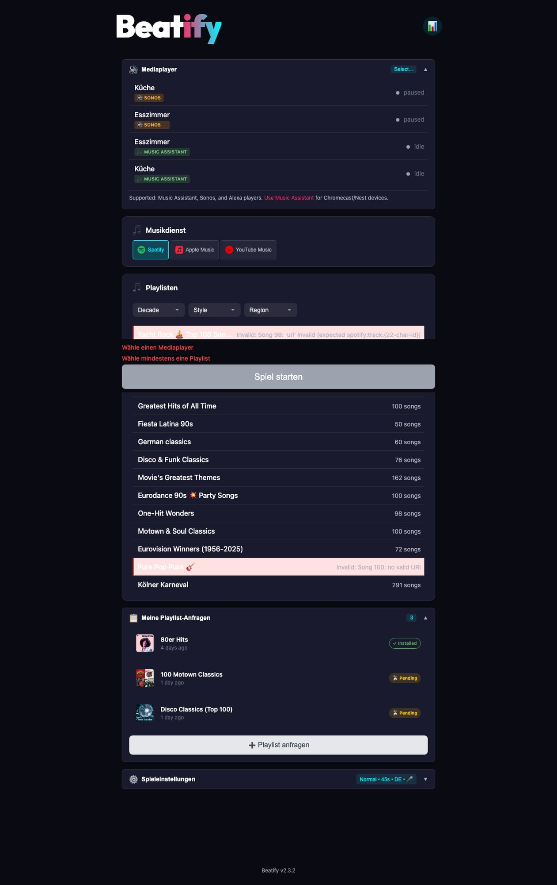
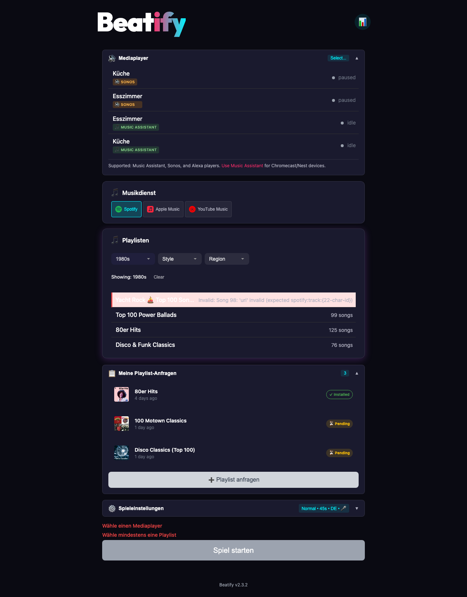
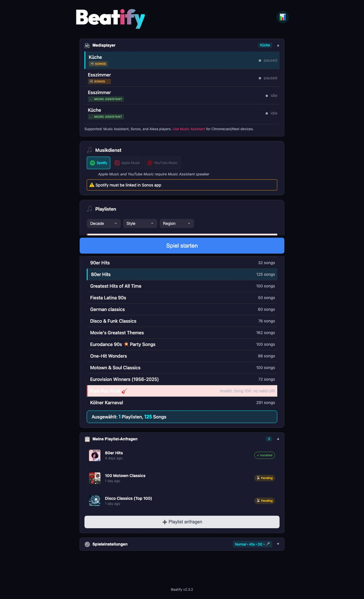
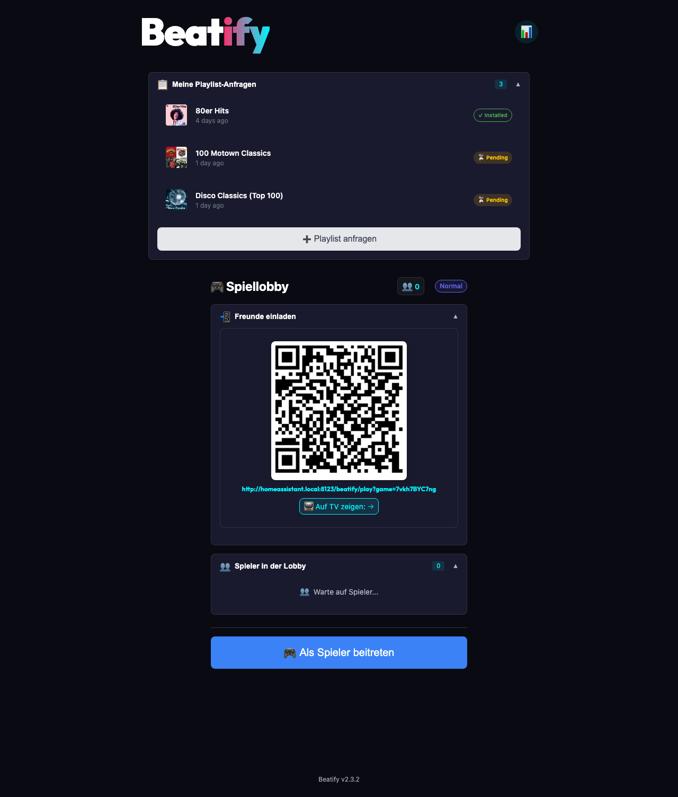
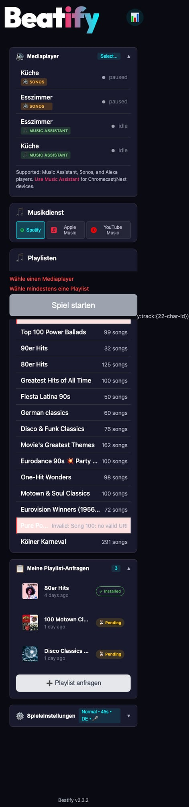
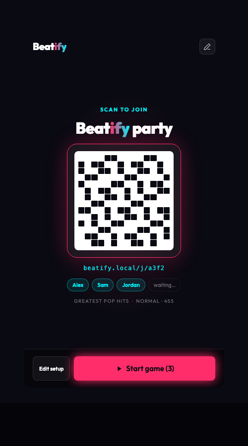
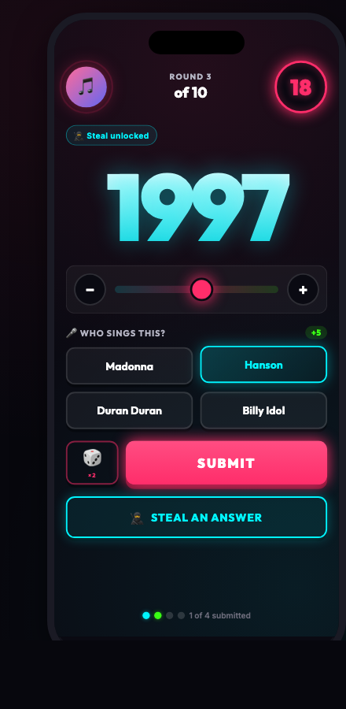
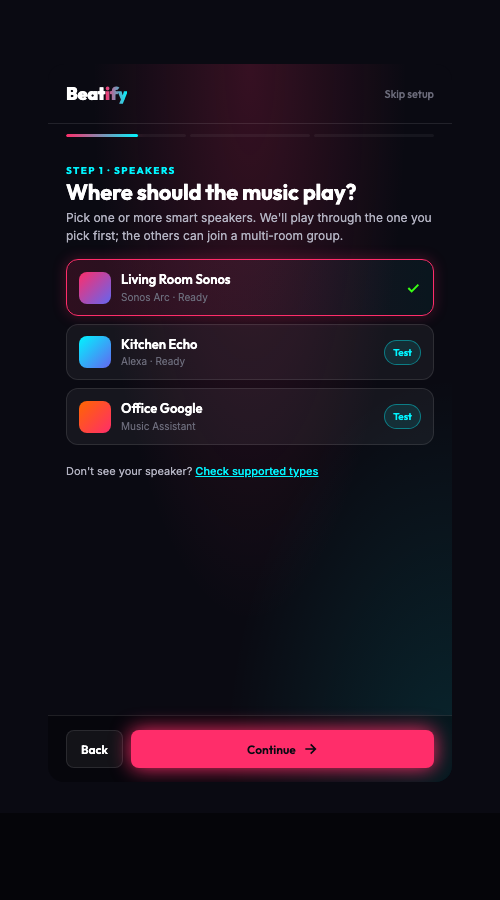
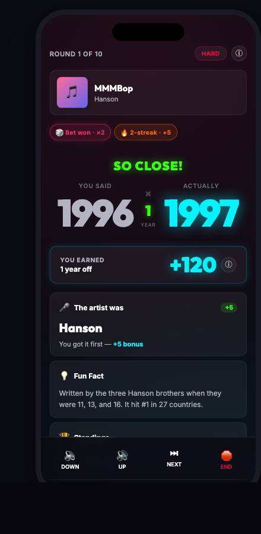
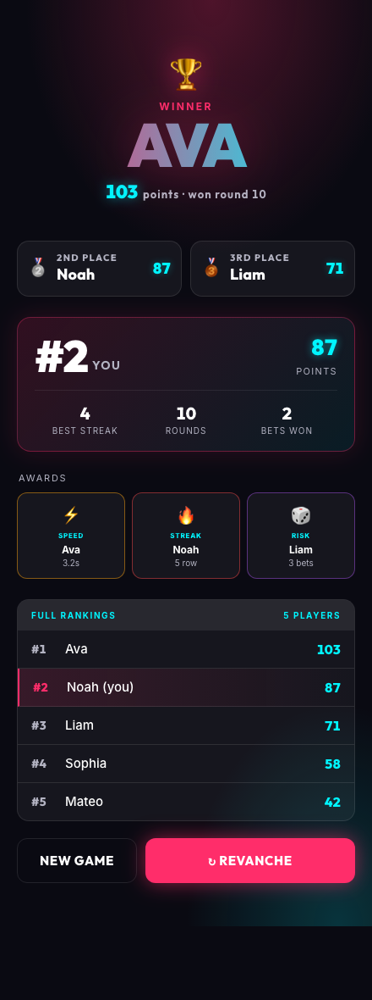

<div align="center">

# Beatify


### **The Party Game Your Smart Home Was Made For**

Turn any gathering into an unforgettable music trivia experience.
Guests scan, songs play, everyone competes. It's that simple.

[](https://www.home-assistant.io/)
[](https://github.com/mholzi/beatify/releases)
[](LICENSE)

[**Get Started**](#setup-in-home-assistant) • [**Supported Speakers**](#supported-speakers) • [**See It In Action**](#the-experience)

---

</div>

<br>

## What Is Beatify?

**Beatify is a multiplayer music year-guessing game that runs entirely on your Home Assistant.**

A song plays through your speakers. Everyone races to guess the release year. Points fly. Streaks build. Champions emerge.

No apps to download. No accounts to create. Just scan a QR code and play.

---

<br>

## Why Parties Are Better With Beatify

**Zero Friction Entry** — Guests scan a QR code. That's it. No apps. No accounts. No WiFi password drama. 10 seconds from scan to playing.

**Uses Your Existing Setup** — Works with Music Assistant, Sonos, and Alexa speakers you already have. See [Supported Speakers](#supported-speakers) for details.

**Your Music, Your Vibe** — Spotify, Apple Music, or YouTube Music playlists. Curated song packs included. Create your own.

**Runs Locally** — No cloud. No subscription. No data leaves your network. Fast, private, reliable.

**Everyone Competes** — Points, streaks, power-ups, and a dramatic finale with podium and stats. Real competition, real laughs.

---

<br>

## Screenshots

<details>
<summary><strong>🖥️ Admin Dashboard</strong> — Set up your game in seconds</summary>
<br>

</details>

<details>
<summary><strong>🎵 Playlist Selection</strong> — Filter by decade, style, and region</summary>
<br>

</details>

<details>
<summary><strong>🎮 Game Setup</strong> — Pick your speaker and playlist, hit start</summary>
<br>

</details>

<details>
<summary><strong>📱 Lobby</strong> — Guests scan the QR code to join</summary>
<br>

</details>

<details>
<summary><strong>👋 Player Join</strong> — Enter a name and you're in</summary>
<br>

</details>

<details>
<summary><strong>📱 Mobile View</strong> — Fully responsive on any device</summary>
<br>

</details>

---

<br>

## Setup In Home Assistant

### Step 1: Install

**Via HACS (Recommended)**
```
HACS → ⋮ Menu → Custom Repositories
→ URL: https://github.com/mholzi/beatify
→ Category: Integration
→ Install "Beatify"
→ Restart Home Assistant
```

**Manual**
```bash
cd /config/custom_components
git clone https://github.com/mholzi/beatify.git beatify
# Restart Home Assistant
```

### Step 2: Configure

```
Settings → Devices & Services → Add Integration → "Beatify"
```

That's it. Beatify is now installed.

---

<br>

## Opening Beatify (Admin)

After installation, access Beatify to start a game:

### Option 1: HA Sidebar (Recommended)

Beatify automatically adds itself to your Home Assistant sidebar.

1. Open Home Assistant
2. Look for **Beatify** in the left sidebar
3. Click to open

> **Tip:** If you don't see Beatify in the sidebar, restart Home Assistant.

### Option 2: Direct URL

```
http://YOUR-HA-IP:8123/beatify/admin
```

### Option 3: HA Companion App

1. Open the HA Companion app
2. Tap the menu (☰) or swipe from left
3. Select **Beatify** from the sidebar

### Starting a Game

1. **Select a speaker** — Only [supported speakers](#supported-speakers) appear
2. **Choose your music service** — Spotify or Apple Music (depends on speaker)
3. **Pick playlists** — Select one or more
4. **Adjust settings** — Language, timer, difficulty
5. **Start Game** — Share the QR code with guests

<div align="center">

<!-- SCREENSHOT: QR code display with join URL -->


*Print it. Display it. Share it.*

</div>

---

<br>

## The Experience

<div align="center">

### For Players

<!-- SCREENSHOT: Player's phone showing the year slider and album art -->


*Slide to guess. Tap to submit. Pray you're right.*

</div>

**The Rush**
A song starts playing. The clock is ticking. You *know* this song... but was it '85 or '87?

**The Strategy**
Answer fast for bonus points. Hit a streak for multipliers. Feeling confident? Bet double-or-nothing.

**The Reveal**
The year drops. The room erupts. Someone nailed it. Someone was *way* off. Everyone's laughing.

Gold confetti bursts for exact guesses. Chart positions and fun facts appear. You just learned that song spent 22 weeks at #1.

<br>

<div align="center">

### For Hosts

<!-- SCREENSHOT: Admin setup screen with media player and playlist selection -->


*Select speakers. Pick playlists. Start the party.*

</div>

**Full Control**
Skip tracks. Adjust volume. Pause the game. End early if needed. All from your phone.

**Customize the Challenge**
Set round timers (15s/30s/45s) and difficulty levels (Easy/Normal/Hard) to match your group.

**Print the QR**
Physical QR code printout for the coffee table. Guests join themselves.

**Play Along**
Join as a player with admin controls. Compete and manage simultaneously.

---

<br>

## Game Features

<div align="center">

<!-- SCREENSHOT: Reveal screen showing correct year, fun fact, and scores -->


*The moment of truth. Every single round.*

</div>

### Scoring That Creates Drama

Choose your difficulty—each changes how points are awarded:

| Difficulty | Exact | Close | Near | The Vibe |
|------------|-------|-------|------|----------|
| 😊 **Easy** | 10 pts | ±7 yrs = 5 pts | ±10 yrs = 1 pt | Forgiving |
| 🎯 **Normal** | 10 pts | ±3 yrs = 5 pts | ±5 yrs = 1 pt | Balanced |
| 🔥 **Hard** | 10 pts | ±2 yrs = 3 pts | — | Punishing |

### Speed Bonus
Submit instantly: **2x multiplier**
Submit at deadline: **1x multiplier**
Linear scale in between. Hesitation costs points.

### Streak Milestones
- **3 in a row:** +20 bonus points
- **5 in a row:** +50 bonus points
- **10 in a row:** +100 bonus points

Miss one? Streak resets. The pressure is real.

### Double or Nothing
Feeling confident? Toggle the bet before submitting.
Score points: **Double them.**
Score zero: **Lose it all.**

### Artist Challenge (Optional)
Know your artists? Enable this mode in game setup.
Guess the artist after the song: **+5 bonus points.**
Alternate names accepted—"Prince" or "The Artist" both count.

---

<br>

## The Finale

<div align="center">

<!-- SCREENSHOT: End game podium showing top 3 players with medals -->


*Glory. Bragging rights. Maybe a rematch.*

</div>

Fireworks explode for the winner. Full podium with medals. Personal stats. Best streaks. Bets won.

See how your game compared to all-time averages. Set a new record? Rainbow confetti and a "NEW RECORD!" badge.

Everything you need to demand a rematch.

---

<br>

## Viewing & Selecting Playlists

Playlists are displayed on the main Beatify admin screen:

1. Open Beatify (see above)
2. Scroll to the **Playlists** section
3. Check the boxes next to playlists you want to use in your game
4. Selected playlists show their song count

### Included Playlists

Beatify comes with 1,565 songs across 15 curated playlists:

- 🎵 **Motown & Soul Classics** — 100 iconic soul tracks from Diana Ross, Marvin Gaye, The Temptations
- 🕺 **Disco & Funk Classics** — 76 essential disco and funk tracks from the 70s and 80s
- 💃 **Fiesta Latina 90s** — 50 Latin party anthems from Shakira, Ricky Martin, Maná
- 🎹 **80er Hits** — 125 classic hits from the decade of synths and MTV
- 🎵 **90er Hits** — 32 essential tracks from the decade
- 💥 **Eurodance 90s** — 100 party songs from the eurodance era
- 🎸 **Pure Pop Punk** — 100 essential pop-punk tracks from the 2000s
- ⛵ **Yacht Rock** — 100 smooth West Coast classics from the 70s and 80s
- 💔 **Power Ballads** — 99 epic rock ballads from the 80s and 90s
- 🎯 **Greatest Hits of All Time** — 100 chart-toppers across four decades
- 🏆 **Eurovision Winners (1956-2025)** — 72 winning songs
- 🎤 **One-Hit Wonders** — 98 flash-in-the-pan classics
- 🎭 **Kölner Karneval** — 291 German carnival favorites
- 🎶 **Schlager Klassiker** — 60 German schlager classics
- 🎬 **Movies: 100 Greatest Themes** — 162 iconic film soundtracks

### Adding Custom Playlists

Custom playlists are stored in: `config/beatify/playlists/`

See [Creating Playlists](#creating-playlists) for the JSON format.

---

<br>

## Creating Playlists

Beatify uses simple JSON playlists stored in `config/beatify/playlists/`.

```json
{
  "name": "80s Classics",
  "songs": [
    {
      "year": 1983,
      "uri": "spotify:track:4cOdK2wGLETKBW3PvgPWqT",
      "fun_fact": "Spent 8 weeks at #1"
    },
    {
      "year": 1985,
      "uri": "spotify:track:2374M0fQpWi3dLnB54qaLX",
      "fun_fact": "Written in just 10 minutes"
    }
  ]
}
```

**Playlist Tips:**
- Mix decades for variety
- Include recognizable songs (obscure = frustrating)
- Add fun facts for the reveal screen
- 10-20 songs per playlist works great

Sample playlists are included to get you started immediately.

---

<br>

## Multi-Language Support

Beatify speaks your guests' language.

- **English** — Full support
- **Deutsch** — Vollständige Unterstützung
- **Español** — Soporte completo

Select during game setup. All players see the chosen language. Fun facts and awards are also translated!

---

<br>

## Supported Speakers

Beatify works with specific Home Assistant integrations that support music playback:

| Integration | Supported | Spotify | Apple Music | YouTube Music | How It Works |
|-------------|-----------|---------|-------------|---------------|--------------|
| **[Music Assistant](https://music-assistant.io/)** | ✅ Yes | ✅ | ✅ | ✅ | Direct URI playback to any connected speaker |
| **Sonos** | ✅ Yes | ✅ | ❌ | ❌ | Direct Spotify playback via Sonos integration |
| **Alexa Media Player** | ✅ Yes | ✅ | ✅ | ❌ | Voice search playback ("Play [song] on Spotify") |
| **Cast (Chromecast/Nest/Google TV)** | ❌ No | — | — | — | Use Music Assistant instead |
| **HomePod** | ❌ No | — | — | — | Use Music Assistant instead |

### Why Some Speakers Don't Work Directly

**Cast devices** (Chromecast, Nest Audio, Nest Hub, Google TV) and **HomePod** don't support direct music playback from Home Assistant. They require a streaming source.

**The solution:** Install [Music Assistant](https://music-assistant.io/) and add your Cast/HomePod devices there. Music Assistant acts as the streaming source and works perfectly with Beatify.

### Quick Compatibility Check

In Beatify's admin screen:
- ✅ **Supported players** show with a platform badge (Music Assistant, Sonos, Alexa)
- ❌ **Unsupported players** (Cast, etc.) are hidden with a hint to use Music Assistant

---

<br>

## Technical Details

### Requirements
- **Home Assistant** 2024.1+
- **Supported media player** (see [Supported Speakers](#supported-speakers) above)
- **HACS** (recommended) or manual installation

### How It Works
- Native Home Assistant integration
- WebSocket-based real-time sync
- Local processing—no cloud required
- Session persistence for reconnection
- Up to 20+ concurrent players

### Architecture
```
Home Assistant
    └── Beatify Integration
            ├── Game State Manager
            ├── WebSocket Handler
            ├── Media Player Service
            └── Web UI (Admin + Player)
```

---

<br>

## FAQ

<details>
<summary><strong>How many players can join?</strong></summary>
<br>
Tested with 20+ players. Your WiFi is the only real constraint.
</details>

<details>
<summary><strong>Can someone join mid-game?</strong></summary>
<br>
Yes! Late joiners inherit the average score so they can compete fairly.
</details>

<details>
<summary><strong>What if the host disconnects?</strong></summary>
<br>
Game pauses automatically. Reconnect and continue exactly where you left off.
</details>

<details>
<summary><strong>What music services work?</strong></summary>
<br>
Spotify, Apple Music, and YouTube Music. Support depends on your speaker platform—see the <a href="#supported-speakers">Supported Speakers</a> table for details.
</details>

<details>
<summary><strong>Why don't my Chromecast/Nest speakers appear?</strong></summary>
<br>
Cast devices (Chromecast, Nest Audio, Nest Hub, Google TV) don't support direct music playback from Home Assistant. Install <a href="https://music-assistant.io/">Music Assistant</a> and add your Cast devices there—they'll then appear in Beatify and work perfectly.
</details>

<details>
<summary><strong>Do players need to be on the same network?</strong></summary>
<br>
Yes, players need to access your Home Assistant instance. Works great on home WiFi.
</details>

<details>
<summary><strong>Can I customize the theme?</strong></summary>
<br>
The neon dark theme is built-in and looks stunning. Custom theming is on the roadmap.
</details>

---

<br>

## What's New

### v2.3.2 — Soul, Disco & Latin Expansion 🎵
- **3 new playlists** — Motown & Soul Classics (100 songs), Disco & Funk Classics (76 songs), Fiesta Latina 90s (50 songs)
- **Data quality pass** — Added artist/title to Movies & Schlager (222 tracks), normalized Karneval chart data
- **Streaming URI enrichment** — 82 new Apple Music and YouTube Music URIs across Movies and Power Ballads
- **Enrichment tooling** — New `enrich_playlists.py` script for automated cross-platform URI lookup

### v2.3.0 — Playlist Tags & Filter UI 🏷️
- **Tag-based filtering** — Filter playlists by decade, genre, region, and mood in the Admin UI
- **Pure Pop Punk playlist** — 100 essential pop-punk tracks from the 2000s
- **Yacht Rock playlist** — 100 smooth West Coast classics
- **Expanded 80er Hits** — Grew from 100 to 125 tracks
- **New 90er Hits** — 32 essential tracks from the decade

### v2.2.0 — YouTube Music & Playlist Requests 🎵
- **YouTube Music support** — Use YouTube Music as your music provider alongside Spotify and Apple Music
- **Custom playlist requests** — Users can request Spotify playlists directly from the Beatify interface
- **80er Hits playlist** — 100 classic hits from Michael Jackson, Prince, Madonna, A-ha, and more

### v2.1.0 — Smart Speaker Routing 🔊
- **Multi-platform speaker support** — Automatic detection for Music Assistant, Sonos, and Alexa
- **Dynamic music service selector** — Shows only compatible services for your selected speaker
- **Cast device guidance** — Helpful hints for Chromecast/Nest users to install Music Assistant

### v2.0.0 — React & Reveal 🎭✨
- **Live emoji reactions** — Send 🔥 😂 😮 👏 💀 reactions during reveals that float across all screens
- **Artist Challenge mode** — Guess the artist for +5 bonus points, with alternate name support
- **Early reveal** — Round ends instantly when all players have guessed
- **Complete UI redesign** — Collapsible admin sections, unified lobbies, compact reveal view
- **One-Hit Wonders playlist** — 98 songs celebrating flash-in-the-pan hits
- **Kölner Karneval playlist** — 291 songs of Cologne carnival tradition

### v1.5.0 — Data & Speed 📊⚡
- **Admin analytics dashboard** — Track games played, popular playlists, player stats, and error rates
- **Mobile performance boost** — 53% smaller bundles, lazy loading, adaptive animations
- **Music Assistant support** — Native playback service for reliable MA integration
- **Styled confirmation dialogs** — No more ugly browser popups
- **Game settings display** — See rounds and difficulty in the player lobby

### v1.4.0 — Fiesta Internacional 🌍
- **Spanish language support** — Full UI and playlist content in Spanish
- **German playlist content** — Fun facts and awards translated for all 370 songs
- **TV Dashboard improvements** — Easier to find, shows round stats and fun facts
- **Invite late joiners** — QR popup during gameplay for latecomers
- **Admin lobby makeover** — Dark theme, player list, real-time updates
- **Alexa fix** — Spotify playback now works on Alexa devices

### v1.3.0 — Steal the Show 🥷
- **Steal power-up** — Build a 3-streak, then copy another player's answer
- **End-game superlatives** — Awards for Speed Demon, Hot Streak, Risk Taker, Clutch Player, and Close Calls
- **Song difficulty rating** — 1-4 star ratings based on historical player accuracy
- **Reliability improvements** — Pre-flight speaker checks, smart retry logic, graceful error handling

### v1.2.0 — The Party Just Got Better 🎉
- **Rich song information** — Chart history, certifications, awards, and fun facts on every reveal
- **Game statistics** — Track performance across games with all-time averages and "NEW RECORD!" moments
- **Confetti celebrations** — Gold bursts for exact guesses, fireworks for winners, epic shows for perfect games
- **Mystery mode** — Album covers blur during guessing (no more peeking!)
- **New playlist** — Eurovision Winners (1956-2025) with 72 winning songs

### v1.1.0
- **Difficulty presets** — Easy, Normal, or Hard scoring modes
- **Customizable round timer** — Quick (15s), Normal (30s), or Relaxed (45s)
- **Round analytics** — See guess distribution, accuracy stats, and speed champions

[View full changelog →](https://github.com/mholzi/beatify/releases)

---

<br>

## Troubleshooting

**No speakers appearing in Beatify?**
- Only Music Assistant, Sonos, and Alexa Media Player speakers are supported
- Cast devices (Chromecast, Nest, Google TV) require [Music Assistant](https://music-assistant.io/)
- HomePod requires Music Assistant
- See [Supported Speakers](#supported-speakers) for the full compatibility table

**Players can't connect?**
- Verify Home Assistant is accessible on your network
- Try IP address instead of hostname
- Ensure port 8123 is reachable

**Music won't play?**
- Check media player is online in Home Assistant
- Verify playlist URIs are valid for your music service
- For Sonos: Only Spotify is supported (not Apple Music)
- For Alexa: Ensure your music service is linked in the Alexa app
- Check Home Assistant logs for errors

**QR code won't scan?**
- Improve lighting on the display
- Try the "Print QR" feature for a physical copy
- Use a dedicated QR scanner app

---

<br>

## Help & FAQ

Have a question? Check our [Discussions Q&A](https://github.com/mholzi/beatify/discussions/categories/q-a) for answers to common questions about installation, music services, gameplay, and troubleshooting.

💡 **Got an idea?** Share it in [Ideas](https://github.com/mholzi/beatify/discussions/categories/ideas)
🐛 **Found a bug?** Open an [Issue](https://github.com/mholzi/beatify/issues)
🎵 **Want a playlist?** Submit a request through the Admin UI

---

<br>

## Contributing

Contributions welcome!

1. Fork the repository
2. Create a feature branch (`git checkout -b feature/amazing-thing`)
3. Commit your changes (`git commit -m 'Add amazing thing'`)
4. Push to the branch (`git push origin feature/amazing-thing`)
5. Open a Pull Request

---

<br>

## License

MIT License. See [LICENSE](LICENSE) for details.

---

<br>

<div align="center">

## Ready to Host?

The next great party moment is one QR scan away.

[**Install Beatify Now**](#5-minute-setup)

---

**Built for Home Assistant. Built for fun.**

[Report Bug](https://github.com/mholzi/beatify/issues) · [Request Feature](https://github.com/mholzi/beatify/issues) · [Discussions](https://github.com/mholzi/beatify/discussions)

<br>

<sub>Made with ❤️ for the Home Assistant community</sub>

</div>
