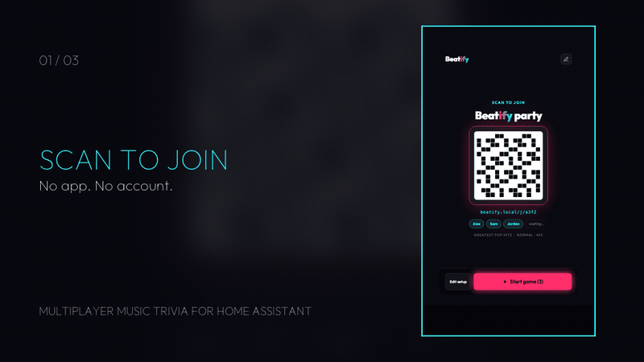

<div align="center">

# Beatify



### **Multiplayer Music Trivia Quiz Game for Home Assistant**

Turn any gathering into an unforgettable music trivia experience.
Guests scan, songs play, everyone competes. It's that simple.

[](https://www.home-assistant.io/)
[](https://github.com/mholzi/beatify/releases)
[](LICENSE)

[**Get Started**](#setup-in-home-assistant) • [**Supported Speakers**](#supported-speakers) • [**See It In Action**](#the-experience)

---

</div>

<br>

## What Is Beatify?

**Beatify is an open-source music quiz game for Home Assistant** — a multiplayer music trivia party game that turns your smart speakers into a game show.

A song plays through your Sonos, Alexa, or Music Assistant speakers. Everyone races to guess the release year — or, in the new **Title & Artist** mode, to name the song and who sings it. Points fly. Streaks build. Champions emerge.

No apps to download. No accounts to create. Just scan a QR code and play.

---

<br>

## Why Parties Are Better With Beatify

**Zero Friction Entry** — Guests scan a QR code. That's it. No apps. No accounts. No WiFi password drama. 10 seconds from scan to playing.

**Uses Your Existing Smart Speakers** — Works with Music Assistant, Sonos, and Alexa speakers you already have. See [Supported Speakers](#supported-speakers) for details.

**Two Ways to Play** — Guess the release year, or switch to **Title & Artist** mode and type the song title (+10) and artist (+5) in free text, with typo-forgiving partial credit. Close calls go to a live 👍/👎 vote — *Crowd Court* — that the whole room watches on the TV.

**Your Music, Your Vibe** — Spotify, Apple Music, YouTube Music, Tidal, Deezer, or Amazon Music (Alexa) playlists. Curated song packs included. Create your own.

**Runs Locally** — No cloud, no Beatify account, no data leaves your network. Free and open-source. (You bring your own music-streaming subscription — see [Requirements](#requirements).)

**Everyone Competes** — Points, streaks, power-ups, and a dramatic finale with podium and stats. Real competition, real laughs.

---

<br>

## Setup In Home Assistant

### Step 1: Install

**Via HACS (Recommended)** — One click to add the repository, then install:

[](https://my.home-assistant.io/redirect/hacs_repository/?owner=mholzi&repository=beatify&category=integration)

Or manually:
```
HACS → ⋮ Menu → Custom Repositories
→ URL: https://github.com/mholzi/beatify
→ Category: Integration
→ Install "Beatify"
→ Restart Home Assistant
```

**Manual**
```bash
cd /config/custom_components
git clone https://github.com/mholzi/beatify.git beatify
# Restart Home Assistant
```

### Step 2: Configure

[](https://my.home-assistant.io/redirect/config_flow_start/?domain=beatify)

Or manually:
```
Settings → Devices & Services → Add Integration → "Beatify"
```

That's it. Beatify is now installed.

---

<br>

## Opening Beatify (Admin)

After installation, access Beatify to start a game:

### Option 1: HA Sidebar (Recommended)

Beatify automatically adds itself to your Home Assistant sidebar.

1. Open Home Assistant
2. Look for **Beatify** in the left sidebar
3. Click to open the launcher
4. Hit **"Open Beatify"** — the game opens in a fullscreen new tab (no HA chrome)

> **Tip:** If you don't see Beatify in the sidebar, restart Home Assistant.

### Option 2: Direct URL

```
http://YOUR-HA-IP:8123/beatify/admin
```

### Option 3: HA Companion App

1. Open the HA Companion app
2. Tap the menu (☰) or swipe from left
3. Select **Beatify** from the sidebar

### Hosting Requires a Home Assistant Login

The admin/host side of Beatify is protected by **your Home Assistant login**.
The first time you open `/beatify/admin` on a device (or claim the host role
from the player page), you are sent to the normal HA login screen; after that
the device stays signed in and opening Beatify is instant.

This keeps the host controls private: if your Home Assistant is reachable from
the internet, a stranger who finds the Beatify URL **cannot** start a game,
control playback, trigger your speakers/lights, or end a game — every host
action requires a valid HA login. **Players are unaffected** — joining a game
at `/beatify/play` stays password-free, so guests still scan the QR code and
play with zero friction.

> Any Home Assistant user account can host — Beatify does not distinguish
> between HA admin and non-admin users.

### Options (Settings → Devices & Services → Beatify → Configure)

Beatify exposes a single option in its options flow:

**Enable HA Android Companion auth bypass** — OFF by default.

Some setups hit a login loop when opening Beatify from the **Home Assistant
Companion app on Android**: the host page keeps bouncing back to the login
screen and never reaches the admin UI, so you can't host from the phone. When
this toggle is ON, requests coming from the HA Android Companion app on your
**local network** are treated as the host without a separate login, which
breaks that loop.

> ⚠️ **Security warning.** This weakens host authentication. Leave it **OFF**
> unless the Companion app genuinely cannot authenticate. **Do NOT enable it**
> if Beatify is reachable through **Home Assistant Cloud (Nabu Casa)** or a
> **reverse proxy that does not forward the real client IP** — in those setups
> every request can look like it comes from your local network, so an internet
> visitor could host games, control your speakers/lights, and end games
> **without any credentials**. Players joining at `/beatify/play` are never
> affected either way.

### Starting a Game

**First time?** Beatify drops you into a 5-step first-run wizard that walks you through the whole setup:

1. **Speakers** — Only [supported speakers](#supported-speakers) appear
2. **Music service** — Spotify, Apple Music, YouTube Music, Tidal, Deezer, or Amazon Music (filtered by speaker; Amazon Music is offered only on Alexa)
3. **Playlist** — Pick one or more curated packs
4. **Game mode** — Difficulty, round timer, announcement language, Artist Challenge / Intro Mode / Closest Wins toggles
5. **Lights & Voice** (optional) — Party Lights mode + WLED presets, TTS announcements (only shown if Home Assistant has the entities)

After finishing, you land on the **"Ready to host"** screen: big Beatify wordmark, glowing QR hero card, and a Start game CTA. Share the QR code with guests — they appear as colored tiles as they scan. Hit **Start game** when everyone's in.

**Returning host?** You skip the wizard and land directly on "Ready to host" with your previous picks preselected. Tap **Edit setup** any time to change speaker, service, playlists, or game mode.

<div align="center">

<!-- SCREENSHOT: QR code display with join URL -->


*Print it. Display it. Share it.*

</div>

---

<br>

## Play On A TV (Big-Screen Dashboard)

Beatify ships with a dedicated TV display — a landscape-locked, big-format
view that shows the lobby (QR code + joined players), round artwork, year
reveal, and live leaderboard. Players keep their phones for guessing; the
TV is the shared "stage" everyone watches.

The TV URL:

```
http://YOUR-HA-IP:8123/beatify/static/dashboard.html
```

### Three ways to put it on the TV

1. **Smart TV / Fire TV / Apple TV browser (cleanest)** — Open the URL
   directly in the TV's built-in browser. No laptop in the loop, no browser
   chrome around the page.
2. **Chromecast from Chrome (laptop / desktop)** — Open the URL in Chrome,
   then `⋮ → Cast → Cast tab → <your Chromecast>`. Easiest if you already
   have the URL up to test.
3. **HA Lovelace iframe card (most polished)** — Embed the dashboard
   inside a Lovelace view, then open that view on the TV via HA Cast or
   the HA Companion app. No browser chrome at all:

   ```yaml
   type: iframe
   url: /beatify/static/dashboard.html
   aspect_ratio: 56.25%   # 16:9
   ```

### Sending audio to the TV

The dashboard is purely visual. **Music plays through whichever speaker you
picked in the admin setup**, routed via Music Assistant. If you want the
sound coming out of the TV (or a soundbar/AVR attached to it), select that
device as the playback target in Music Assistant when you set up the game.
The dashboard URL and the audio target are independent — pick each one to
fit your room.

> **Tip:** A Fire TV Stick (or any cheap browser-capable streaming stick)
> opened to the dashboard URL gives you a "permanent" Beatify TV display
> with one device, no laptop required.

---

<br>

## The Experience

<div align="center">

### For Players

<!-- SCREENSHOT: Player's phone showing the year slider and album art -->


*Slide to guess. Tap to submit. Pray you're right.*

</div>

**Learn the Game in 20 Seconds**
Players who scan the QR code drop into a swipeable tour that teaches the core mechanics in order: guess the year, triple-or-nothing bet, steal an answer, guess the artist, and — in Title & Artist games — name that tune. The card count adapts to the game mode automatically. Skip/Next always visible, auto-advances after 4 seconds per card. By the time the host hits Start, everyone knows what to do.

**The Rush**
A song starts playing. The clock is ticking. You *know* this song... but was it '85 or '87?

**The Strategy**
Answer fast for bonus points. Hit a streak for multipliers. Feeling confident? Bet triple-or-nothing.

**The Reveal**
The year drops. The room erupts. Someone nailed it. Someone was *way* off. Everyone's laughing.

Gold confetti bursts for exact guesses. Chart positions and fun facts appear. You just learned that song spent 22 weeks at #1.

<br>

<div align="center">

### For Hosts

<!-- SCREENSHOT: Admin setup screen with media player and playlist selection -->


*First-run wizard walks you through setup. Every choice pre-selected when you land on Start Game.*

</div>

**Full Control**
Skip tracks. Adjust volume. Pause the game. End early if needed. All from your phone.

**Customize the Challenge**
Set round timers (15s/30s/45s) and difficulty levels (Easy/Normal/Hard) to match your group.

**Print the QR**
Physical QR code printout for the coffee table. Guests join themselves.

**Play Along**
Join as a player with admin controls. Compete and manage simultaneously.

---

<br>

## Game Features

<div align="center">

<!-- SCREENSHOT: Reveal screen showing correct year, fun fact, and scores -->


*The moment of truth. Every single round.*

</div>

### Scoring That Creates Drama

Choose your difficulty—each changes how points are awarded:

| Difficulty | Exact | Close | Near | The Vibe |
|------------|-------|-------|------|----------|
| 😊 **Easy** | 10 pts | ±7 yrs = 5 pts | ±10 yrs = 1 pt | Forgiving |
| 🎯 **Normal** | 10 pts | ±3 yrs = 5 pts | ±5 yrs = 1 pt | Balanced |
| 🔥 **Hard** | 10 pts | ±2 yrs = 3 pts | — | Punishing |

### Speed Bonus
Submit instantly: **2x multiplier**
Submit at deadline: **1x multiplier**
Linear scale in between. Hesitation costs points.

### Streak Milestones
- **3 in a row:** +20 bonus points
- **5 in a row:** +50 bonus points
- **10 in a row:** +100 bonus points
- **15 in a row:** +150 bonus points
- **20 in a row:** +250 bonus points
- **25 in a row:** +400 bonus points

Miss one? Streak resets. The pressure is real.

### Triple or Nothing
Feeling confident? Toggle the bet before submitting.
Nail the **exact** year: **triple your points.**
Miss it — even by a year: **score nothing that round.**

### Artist Challenge (Optional)
Know your artists? Enable this mode in game setup.
After the song, it's a race — the **first** player to guess the artist correctly earns **+5 bonus points.**
Alternate names accepted—"Prince" or "The Artist" both count.

### Movie Quiz Bonus (Optional)
For soundtrack songs. Guess the movie a song is from for tiered bonus points: **5 / 3 / 1** by submission speed.
Enable in game setup; only triggers on songs with movie metadata.

### Steal Power-Up
Build a **3-answer streak** to unlock Steal. Once unlocked, tap a rival mid-round to copy their answer when they submit. One steal per game — spend it wisely.

---

<br>

## The Finale

<div align="center">

<!-- SCREENSHOT: End game podium showing top 3 players with medals -->


*Glory. Bragging rights. Maybe a rematch.*

</div>

Fireworks explode for the winner. Full podium with medals. Personal stats. Best streaks. Bets won.

See how your game compared to all-time averages. Set a new record? Rainbow confetti and a "NEW RECORD!" badge.

Everything you need to demand a rematch.

---

<br>

## Viewing & Selecting Playlists

Playlists are displayed on the main Beatify admin screen:

1. Open Beatify (see above)
2. Scroll to the **Playlists** section
3. Check the boxes next to playlists you want to use in your game
4. Selected playlists show their song count

### Included Playlists

Beatify comes with 5,381 songs across 49 curated playlists:

- 🎬 **100 Greatest Movie Themes** — 162 iconic film soundtracks
- ☀️ **100 Summer Anthems** — 112 feel-good tracks from 1957–2020
- 🇧🇷 **100% Brasil** — 66 Brazilian hits across the decades
- 🇪🇸 **100% en Español** — 127 Latin & Spanish classics
- 🇫🇷 **100% Français** — 100 French hits across the eras (chanson, pop, rap, variété)
- 🎵 **2000s Pop Anthems** — 182 essential pop hits from the 2000s
- 🎵 **2010s & 2020s Hits** — 71 chart hits closing the modern-decade gap
- 🎶 **40s & 50s Classics** — 152 swing, crooner and early rock 'n' roll standards
- 🎸 **60s Classics** — 66 tracks from the golden age of rock & roll
- 🎙️ **70s Hits** — 163 essential hits from the seventies
- 🎹 **80s Hits** — 238 classic hits from the decade of synths and MTV
- 🎤 **90s & 2000s Hip-Hop Bangers** — 40 tracks from 2Pac, Eminem, JAY-Z, Nas, Dr. Dre and more
- 🎵 **90s Hits** — 115 essential tracks from the decade
- 🎌 **Anime Openings** — 140 opening themes from Cowboy Bebop to Chainsaw Man
- 🍺 **Ballermann Party Hits** — 189 Mallorca and Schlager party tracks
- 🦒 **Best of Giraffenaffen** — 26 German children's songs
- 🇬🇧 **British Invasion & Britpop** — 100 tracks from The Beatles to Blur
- 🎭 **Cologne Carnival** — 290 German carnival favorites
- 🇩🇪 **Deutschpop Klassiker** — 107 German pop classics, incl. the 90s / NDW canon
- 🕺 **Disco & Funk Classics** — 98 essential disco and funk tracks from the 70s and 80s
- 🏰 **Disney Classics** — 69 soundtrack singalongs from the Disney canon
- 🇩🇪 **Disney Hits Deutschland** — 97 German-language Disney songs, with a guess-the-film bonus across 40 films
- 🎸 **Divorced Dad Rock** — 107 post-grunge, nu-metal and 2000s radio-rock tracks
- 🎧 **EDM Anthems** — 126 festival and mainstream EDM tracks (2009–2024)
- 🎸 **Essential Alternative** — 100 90s/2000s alternative rock essentials
- 💥 **Eurodance 90s** — 100 party songs from the eurodance era
- 🏆 **Eurovision Winners (1956–2025)** — 72 winning songs
- 💃 **Fiesta Latina 90s** — 50 Latin party anthems from Shakira, Ricky Martin, Maná
- 🇫🇮 **Finnish Schlager Classics** — 293 Finnish iskelmä classics
- 🌪️ **Funk Carioca** — 20 Brazilian baile funk hits spanning 2000–2018
- 🧃 **Gen Z Anthems** — 30 tracks from TikTok to Good Luck, Babe! spanning 2009–2024
- 🎯 **Greatest Hits of All Time** — 236 chart-toppers across four decades
- 🤘 **Greatest Metal Songs** — 61 legendary tracks across all major metal subgenres
- 🔊 **Harder Styles** — 190 hardstyle, hardcore and raw tracks
- 🎬 **ICONIC Movie Songs** — 72 songs from the movies, with a dedicated movie-quiz mode
- 🎵 **Motown & Soul Classics** — 100 iconic soul tracks from Diana Ross, Marvin Gaye, The Temptations
- 🎸 **NDW – Neue Deutsche Welle** — 50 German New Wave classics from 1976–1986
- 🎤 **One-Hit Wonders** — 98 flash-in-the-pan classics
- 🇵🇱 **Polski Rock** — 100 Polish rock tracks
- 🇵🇱 **Polskie przeboje wszech czasów** — 100 all-time Polish hits
- 💔 **Power Ballads** — 99 epic rock ballads from the 80s and 90s
- 🎸 **Pure Pop Punk** — 100 essential pop-punk tracks from the 2000s
- 🇩🇪 **Schlager Classics** — 60 German schlager classics
- 🇨🇭 **Schweizer Hits** — 97 Swiss tracks
- ☀️ **Sommerklassiker** — 60 international summer hits from 1978–2023
- 🇳🇱 **Top 100 Dutch Classics** — 104 Nederlandstalig tracks
- 🌀 **Trance Classics** — 120 classic trance anthems
- 🌍 **World Cup Anthems** — 26 official FIFA World Cup songs, 1962–2026
- ⛵ **Yacht Rock** — 100 smooth West Coast classics from the 70s and 80s

### Adding Custom Playlists

Custom playlists are stored in: `config/beatify/playlists/`

See [Creating Playlists](#creating-playlists) for the JSON format.

### Mix Your Own

Don't want to pick whole packs? The **Mix** tab in the playlist picker builds a fresh set on the fly from the tags you care about — no JSON editing required.

1. Open the **Mix** tab in the playlist screen.
2. Pick any combination of tags across four categories — **decade**, **style**, **region**, and **special** (the same taxonomy as the playlist filter bar).
3. Choose a target size: **30**, **50**, or **100** songs.
4. Beatify pulls every track from playlists matching your tags, de-duplicates across packs, and assembles a set at your chosen size.

By default a mix is **transient** — it's built for that one game and isn't saved. Tick **"save as community playlist"** before building and the assembled set is written to `config/beatify/playlists/user/<slug>.json`, where it shows up in the **Community** tab on the next refresh like any other playlist. (Unsaved mixes live in an internal `playlists/mix/` folder and are cleaned up automatically — they never clutter your Community tab.)

You can carry a built mix straight into the setup wizard with **"Weiter → / Continue"**, exactly like selecting a curated pack.

---

<br>

## Creating Playlists

Beatify uses JSON playlists stored in `config/beatify/playlists/`. The full, authoritative format lives in [`scripts/playlist_schema.json`](scripts/playlist_schema.json) (validated in CI by `scripts/validate_playlists.py`). Here is a schema-accurate example:

```json
{
  "name": "80s Classics",
  "version": "1.0",
  "tags": ["decade:80s", "style:pop"],
  "songs": [
    {
      "artist": "Michael Jackson",
      "title": "Billie Jean",
      "year": 1983,
      "uri": "spotify:track:4cOdK2wGLETKBW3PvgPWqT",
      "uri_apple_music": "https://music.apple.com/us/album/_/269572838?i=269573364",
      "uri_youtube_music": null,
      "uri_tidal": null,
      "uri_deezer": null,
      "alt_artists": ["MJ"],
      "fun_fact": "Spent 7 weeks at #1 on the Billboard Hot 100.",
      "fun_fact_de": "Stand 7 Wochen auf Platz 1 der Billboard Hot 100.",
      "fun_fact_es": "Estuvo 7 semanas en el nº 1 del Billboard Hot 100.",
      "fun_fact_fr": "7 semaines à la 1re place du Billboard Hot 100.",
      "fun_fact_nl": "Stond 7 weken op nummer 1 in de Billboard Hot 100."
    }
  ]
}
```

**Required fields**
- Playlist level: `name`, `version`, `tags`, `songs`.
- Per song: `artist`, `title` (both mandatory — songs missing either are **silently skipped at load**, #697, so you can't play Title & Artist mode and the track never appears), `year`, `uri`, and the fun-fact set `fun_fact` + `fun_fact_de` / `fun_fact_es` / `fun_fact_fr` / `fun_fact_nl`.

**Optional fields**
- Extra provider URIs — `uri_apple_music`, `uri_youtube_music`, `uri_tidal`, `uri_deezer` (and `uri_apple_music_by_region` for storefront-specific Apple Music IDs). A song with only a `spotify:` URI plays on Spotify but is skipped on the other services.
- `alt_artists` (accepted spellings for the Artist Challenge), `isrc`, `chart_info`, `certifications`, `awards` (+ localized `awards_de/es/fr/nl`), and the movie-quiz fields `movie` / `movie_choices` (playlist-level `movie_quiz_enabled: true` to turn the mode on).

> The `uri` must be a Spotify track URI (`spotify:track:<22 chars>`) or `null`. Invalid or incomplete songs are dropped silently rather than failing the whole playlist — check the Home Assistant log if a track doesn't show up.

**Playlist Tips:**
- Mix decades for variety
- Include recognizable songs (obscure = frustrating)
- Add fun facts for the reveal screen — one per language
- 10-20 songs per playlist works great

Sample playlists are included to get you started immediately.

---

<br>

## Multi-Language Support

Beatify speaks your guests' language.

- **English** — Full support
- **Deutsch** — Vollständige Unterstützung
- **Español** — Soporte completo
- **Français** — Support complet
- **Nederlands** — Volledige ondersteuning

Select during game setup. All players see the chosen language. Fun facts and awards are also translated!

---

<br>

## Supported Speakers

Beatify works with specific Home Assistant integrations that support music playback:

| Integration | Supported | Spotify | Apple Music | YouTube Music | Tidal | Deezer | Amazon Music | How It Works |
|-------------|-----------|---------|-------------|---------------|-------|--------|--------------|--------------|
| **[Music Assistant](https://music-assistant.io/)** | ✅ Yes | ✅ | ✅ | ✅ | ✅ | ✅ | ❌ | Direct URI playback to any connected speaker |
| **Sonos** | ✅ Yes | ✅ | ❌ | ❌ | ❌ | ❌ | ❌ | Direct Spotify playback via Sonos integration |
| **Alexa Media Player** | ✅ Yes | ✅ | ✅ | ❌ | ❌ | ❌ | ✅ | Voice-search playback ("Play [song] on [service]") |
| **Cast (Chromecast/Nest/Google TV)** | ❌ No | — | — | — | — | — | — | Use Music Assistant instead |
| **HomePod** | ❌ No | — | — | — | — | — | — | Use Music Assistant instead |

> **Amazon Music is Alexa-only and uses text search.** Amazon has no direct-URI playback path, so Beatify asks Alexa to play each track by name (`artist` + `title`) rather than by a fixed track ID. This works well for well-tagged songs but has one caveat: Alexa occasionally picks the wrong version of a track (a live/remaster/cover) when several share a title — the round still plays, it just may not be the exact recording the playlist author intended. For pinpoint accuracy on those tracks, pick a URI-based service (Spotify/Apple Music/etc.) via Music Assistant instead.

### Why Some Speakers Don't Work Directly

**Cast devices** (Chromecast, Nest Audio, Nest Hub, Google TV) and **HomePod** don't support direct music playback from Home Assistant. They require a streaming source.

**The solution:** Install [Music Assistant](https://music-assistant.io/) and add your Cast/HomePod devices there. Music Assistant acts as the streaming source and works perfectly with Beatify.

### Quick Compatibility Check

In Beatify's admin screen:
- ✅ **Supported players** show with a platform badge (Music Assistant, Sonos, Alexa)
- ❌ **Unsupported players** (Cast, etc.) are hidden with a hint to use Music Assistant

### Guest WiFi / Network Setup

Beatify runs entirely within Home Assistant's HTTP server — **no extra ports or services needed**.

| Protocol | Port | Purpose |
|----------|------|---------|
| HTTP/HTTPS | 8123 (default) | Game UI, API, static assets |
| WebSocket | 8123 (same port) | Real-time game communication |

**If guests are on a separate WiFi/VLAN**, add a single firewall rule:

```
Guest VLAN → HA IP : TCP 8123
```

That's it. No mDNS, no broadcast, no additional ports.

**Tips:**
- The QR code uses the HA URL as seen by the admin's browser — make sure that URL is reachable from the guest network
- If using a reverse proxy (nginx/Caddy), ensure WebSocket upgrades are allowed for `/beatify/ws` (standard HA proxy configs already handle this)
- If using HTTPS with a self-signed cert, guests may need to accept it once

> **⚠️ Fritzbox users:** The Fritzbox guest WiFi fully isolates clients from your home network — this cannot be overridden with firewall rules. Players must join the main WiFi, or use a separate VLAN-capable router/access point to create a guest network with selective LAN access.

---

<br>

## Technical Details

### Requirements
- **Home Assistant** 2025.1+ (matches the `homeassistant` floor declared in `hacs.json`)
- **Supported media player** (see [Supported Speakers](#supported-speakers) above)
- **A music service** — Spotify, Apple Music, YouTube Music, Tidal, Deezer or Amazon Music, each of which needs a **paid plan** (on-demand single-track playback; free/ad-supported tiers don't allow it — Spotify Free is blocked, and Music Assistant's YouTube Music provider [requires Premium too](https://www.music-assistant.io/music-providers/youtube-music/)). Amazon Music playback is Alexa-only (text search — see [Supported Speakers](#supported-speakers)).
- **HACS** (recommended) or manual installation

### How It Works
- Native Home Assistant integration
- WebSocket-based real-time sync
- Local processing—no cloud required
- Session persistence for reconnection
- Up to 20+ concurrent players

### Architecture
```
Home Assistant
    └── Beatify Integration
            ├── Game State Manager
            ├── WebSocket Handler
            ├── Media Player Service
            └── Web UI (Admin + Player)
```

---

<br>

## Built With AI Assistance

Beatify is built with substantial help from AI coding tools (Claude Code). That's not a confession — it's a feature. Here's what that looks like in practice:

- **Test coverage**: 19 Python test files, JS tests via Vitest, integration tests for the WebSocket protocol — every regression gets a test before the fix lands.
- **Architecture is documented in code**: see `custom_components/beatify/services/media_player.py` lines 111–128 — the comment block walks through *why* the provider-URI dispatch was rewritten, names the specific user (Levtos) whose bug report drove the change, and references the original GitHub issues (#768, #805, #808).
- **800+ closed issues with traceable root causes**, not just "fixed". URI-validation, playback-recovery, and import-flow security got dedicated sweeps in v3.3.x.
- **Real users, not vanity metrics**: 174 stars, 7 forks (forks = devs reading the code), 289 active HACS installs, top 14% HACS rank, MIT-licensed.

The AI is the typist. The decisions, the architecture, the bug triage, and the "ship it" call are all human. If something looks off in the code, [open an issue](https://github.com/mholzi/beatify/issues) — that's how the documented bug-fix sweeps started in the first place.

---

<br>

## FAQ

<details>
<summary><strong>What game modes are there? How do you play Title & Artist?</strong></summary>
<br>
Two modes, chosen by the host in the setup wizard. <strong>Year</strong> mode is the classic: a song plays and everyone slides to guess the release year, scored by how close you are. <strong>Title &amp; Artist</strong> mode asks you to type the song title (<strong>+10</strong>) and the artist (<strong>+5</strong>) in free text — you don't have to be letter-perfect, since small typos earn partial credit and the forgiveness scales with title length. Genuinely close guesses go to <em>Crowd Court</em>, a live 30-second 👍/👎 vote the whole room can watch on the TV; plainly wrong answers are marked Wrong and scored zero. Movie Quiz and Intro bonuses stack on top of either mode. For a high-stakes twist, turn on <strong>Sudden Death</strong> (needs at least 3 players): from round 2 on, the lowest-scoring player each round is eliminated until one winner is left standing — arm it in the wizard or flip it on live from the reveal screen.
</details>

<details>
<summary><strong>How many players can join?</strong></summary>
<br>
Tested with 20+ players. Your WiFi is the only real constraint.
</details>

<details>
<summary><strong>Can someone join mid-game?</strong></summary>
<br>
Yes! Late joiners inherit the average score so they can compete fairly.
</details>

<details>
<summary><strong>What if the host disconnects?</strong></summary>
<br>
Game pauses automatically. Reconnect and continue exactly where you left off.
</details>

<details>
<summary><strong>What music services work?</strong></summary>
<br>
Spotify, Apple Music, YouTube Music, Tidal, Deezer, and Amazon Music. Support depends on your speaker platform—see the <a href="#supported-speakers">Supported Speakers</a> table for details. Amazon Music is available on Alexa speakers only and plays via voice/text search rather than fixed track URIs.
</details>

<details>
<summary><strong>Do I need a paid music subscription? Does Beatify work with free Spotify?</strong></summary>
<br>
Yes. Beatify plays a specific song on demand each round, and on every provider—Spotify, Apple Music, YouTube Music, Tidal, Deezer and Amazon Music—that requires a <strong>paid</strong> plan. <strong>Spotify Free does not work</strong> (its free tier blocks on-demand single-track playback via Music Assistant / Spotify Connect), and <strong>a free YouTube Music account does not work either</strong>—playback runs through Music Assistant, whose <a href="https://www.music-assistant.io/music-providers/youtube-music/">YouTube Music provider</a> supports Premium accounts only. This is a streaming-service limitation, not a Beatify one. The curated playlists carry URIs for the five URI-based services; Amazon Music (Alexa-only) plays those same tracks by text search (<code>artist</code> + <code>title</code>) rather than a fixed URI.
</details>

<details>
<summary><strong>Why don't my Chromecast/Nest speakers appear?</strong></summary>
<br>
Cast devices (Chromecast, Nest Audio, Nest Hub, Google TV) don't support direct music playback from Home Assistant. Install <a href="https://music-assistant.io/">Music Assistant</a> and add your Cast devices there—they'll then appear in Beatify and work perfectly.
</details>

<details>
<summary><strong>Do players need to be on the same network?</strong></summary>
<br>
Yes, players need to access your Home Assistant instance. Works great on home WiFi.
</details>

<details>
<summary><strong>Can I customize the theme?</strong></summary>
<br>
The neon dark theme is built-in and looks stunning. Custom theming is on the roadmap.
</details>

---

<br>

## What's New

### v4.2.0 — Sudden Death 💀
- **New game mode: Sudden Death** — an elimination format where, from round 2 on, the lowest-scoring player each round is knocked out until only one is left standing. Ties for last go to the slowest submitter, the TV shows an "OUT" takeover for whoever was just eliminated, and the winner earns a "last one standing" highlight. Needs at least 3 players; arm it in the setup wizard or flip it on live from the reveal screen (#827, #1472)
- 6 music platforms, 5 languages

### v4.1.3 — Content & Reliability ☀️
- **Speaker volume is restored when the game ends (#1516)** — if the host bumps the volume mid-game, Beatify hands the speaker back at its original level, complementing the party-lights state restore
- **Speaker selection now applies immediately (#1526)** — switching speakers in the wizard takes effect right away instead of routing through the previous pick until a Home Assistant restart
- **Android Chrome no longer auto-translates the UI (#1527)** — the page language is rendered server-side so the initial HTML already matches the locale
- **Two new German playlists** — Sommerklassiker ☀️ (60) and NDW – Neue Deutsche Welle (50)
- 6 music platforms, 5 languages

### v4.1.2 — Disney auf Deutsch 🏰
- **New community playlist "Disney Hits Deutschland 🇩🇪" (97 songs)** — German-language Disney songs across the decades, year-mode ready with multi-provider URIs and the guess-the-film bonus across 40 films (#1505)
- 6 music platforms, 5 languages

### v4.1.1 — Around the World 🌍
- **Two new community playlists** — 100% Brasil 🇧🇷 (66) and 100% Français 🇫🇷 (100), each year-mode ready with verified release years, ISRCs and multi-provider URIs
- **Country packs renamed to the "100% <Country>" scheme** — matching the existing 100% en Español
- Data fixes across EDM Anthems, Trance Classics, Harder Styles and Finnish Schlager Classics
- 6 music platforms, 5 languages

### v4.1.0 — Rock Solid, New Look (Now on Amazon Music) 🛒
- **Amazon Music is the sixth music provider** — play through Alexa speakers via voice/text search (`artist` + `title`), no fixed track URI needed. Alexa-only; see [Supported Speakers](#supported-speakers) for the text-search caveat
- **Reveal & dashboard redesigned — Spotlight Stage / Podium Stage** — the round reveal, round-delta standings ledger, TV broadcast lower-third and end-game podium were rebuilt into one cinematic broadcast language, with the guess-the-artist result and Game Highlights reel finally shown on the TV
- **Party-night reliability pass** — screen-wake, TV auto-reconnect and a fixed admin login-loop keep long parties alive
- **Storefront-aware Apple Music fix** — per-region Apple Music IDs resolve against your Home Assistant country so the right catalog track plays
- **Security pass** across the import and request flows
- **New community playlist "Finnish Schlager Classics 🇫🇮" (293 songs)** — deduplicated iskelmä from 1949–2026, year-mode ready
- 6 music platforms, 5 languages

### v4.0.0 — Name That Tune 🎵
- **A whole new game mode: Title & Artist** — instead of guessing the year, answer in free text: song title (**+10**) and artist (**+5**), each scored on its own. Small typos and near spellings earn partial credit, with forgiveness that scales to the title's length. Movie and Intro bonuses still stack. Built by @jgossen01, from an idea by @Hendrik0123 (#1180)
- **Crowd Court — the reveal becomes a live verdict** — close calls go to a 30-second 👍/👎 room vote with a glowing countdown, running tally, and host Accept/Reject override. The TV shows the same vote in real time so the whole room can weigh in (#1180, #1243)
- **Pick your mode up front** — the setup wizard opens with two cards (📅 Year or ✍️ Title & Artist) and shows only the settings that apply; the first-join tour gains a "Name that tune" card
- **End-of-game awards made for Title & Artist** — 💯 Perfect Pair, 🧠 Name Dropper, 🎤 Artist Whisperer, and 🤏 So Close, across all 5 locales
- **The cover matches the music again** — the dashboard and in-game view no longer show the previous song's album art; Beatify waits for the real artwork before putting it on screen, with full test coverage (#1260, thanks @Dtrieb)
- 39 playlists, 4,340 songs, 5 music platforms, 5 languages

### v3.5.0 — Everyone's Guess, On the Clock 🎯
- **See where everyone guessed** — the reveal's round-stats (ⓘ) sheet now shows every player as a dot on a year timeline: who guessed what, who nailed it, and the points each one earned, with your own dot ringed and the top three medalled
- **A countdown on every screen** — the seconds to the next round now show on the host's Next button, the big TV/dashboard, and each player's phone
- **Voice announcements speak your game language** — German, Spanish, French and Dutch instead of always English, with years and scores spoken as words so neural voices don't swallow the digits
- **Party lights actually fire on game start** — fixed for Govee and other non-Hue / wizard-configured setups; Light Mode chips (Static / Dynamic / WLED) are selectable again
- **Two new playlists** — World Cup Anthems (26, just in time for the tournament) and ICONIC Movie Songs (72, with movie-quiz mode); Disney Classics grew +69
- 39 playlists, 4,340 songs, 5 music platforms, 5 languages

### v3.4.2 — Unstick the Android Launcher 🤖
- **HA Companion on Android opens Beatify again** — The launcher fix that shipped in v3.4.0 for iOS broke Android: tap "Beatify öffnen", see the toast, watch nothing happen. v3.4.2 detects the Android Companion app and navigates the top frame directly instead of opening a new tab that never materialises
- **One-file, one-bug, one-PR rc cycle** — Standard 6-file version bumps; iOS Companion, desktop, and standalone browsers untouched
- Closes #1114; thanks to @Dtrieb, @nixbuongiorno, and @markist for two days of repro and the "works in Brave" datapoint that cracked it
- 35 playlists, 4,013 songs, 5 music platforms, 5 languages

### v3.3.6 — Beatify Finds Its Voice 🎙️
- **The voice roadmap is complete** — TTS Phases 3 & 4 add the last ten announcements (bets, joins, podium, rematch, intro, steals); the per-round reveal is now narrated as one flowing sentence instead of a stutter of clips. 23 spoken moments in total
- **Verbosity presets** — pick Minimal, Standard or Full and all 23 toggles are set for you; fine-tune any of them and it switches to Custom. Available in both the admin TTS panel and the setup wizard
- **Party-night reliability pass** — self-healing stuck rounds (a client watchdog and heartbeat recover frozen rounds and half-open connections), reload-proof host controls, an actionable banner when playback can't start, album art for remote QR-code players, and a TV dashboard that scales to any viewport
- **Two new playlists** — Divorced Dad Rock (107 tracks) and EDM Anthems (126 tracks)
- **Library-wide year audit** — every song checked against MusicBrainz first-release dates; 274 wrong release years corrected
- 32 playlists, 3,566 songs, 5 music platforms, 5 languages

### v3.3.5 — Five New Playlists & Voice That Calls the Game 🎤
- **TTS Player Achievements (Phase 2)** — six voice announcements driven by player results: exact-year guess, Closest-Wins winner, streak milestone, streak broken, new leader, and a tie at the top. Each an independent toggle
- **Five new playlists** — Anime Openings (101), Ballermann Party Hits (189), Harder Styles (150), Best of Giraffenaffen (26) and 2010s & 2020s Hits (128), closing the decade gap to today
- **98 songs backfilled** into the existing decade and greatest-hits playlists
- **Admin Stop button always responds** — visible feedback if the connection drops mid-tap; the fix hardens every admin button. Plus: a reconnect race that could briefly leak a fun fact on the admin dashboard is closed
- 30 playlists, 3,273 songs, 5 music platforms, 5 languages

### v3.3.4 — Cover Blur, Sharp Year Steps & Round-Show Audio 🎙️
- **Round-show audio (TTS Phase 1)** — Five new voice announcements wired into the round flow: round start, optional 3-2-1 countdown, time's up, correct-answer reveal, and a "nobody got it" line. Each is a separate toggle, works with any HA TTS engine
- **Album cover blurs during PLAYING, crisp at REVEAL** — Cover artwork sometimes carries readable titles, years or artist names — now blurred during the round so it can't leak the answer, crisp the moment REVEAL hits
- **Year ±5 buttons next to ±1, and both finally count properly on iOS** — Decade-jump buttons added next to the existing ±1, and the mobile quirk where each tap stepped 2/4/by-the-round-number is gone — now exactly 1 per tap, every time. Long-press repeat still works after 500ms
- **German launcher, lobby and error toasts — fully translated** — Launcher subtitle, wizard summary labels (Speaker → Lautsprecher etc.) and the "End current game first" alert all leaked through in English. Plugged. ES/FR/NL got the same treatment
- **247 broken music URIs repaired** — Yacht-rock playlist (190 across all three providers — Apple Music, Spotify, YouTube Music) plus Pure-Pop-Punk (52 cyclically scrambled), plus 5 maintenance fixes across one-hit-wonders, greatest-metal-songs, top-songs-der-60er
- **Quality-of-life polish** — Playlist detail-sheet Add button respects iPhone home-indicator safe-area, admin lobby no longer drags freely on iOS, reveal cover falls back to no-artwork placeholder when MA artwork URL fails, points breakdown finally sums to total when a Double-or-Nothing bet is won
- 24 playlists, 2,481 songs, 5 music platforms, 5 languages

### v3.2.0 — Onboarding, Redesigns & Design System 🎨
- **First-Run Wizard** — Five-step guided setup for new admins: Speakers → Music service → Playlist → Game mode → Lights/Voice. After finishing, every chip on the admin dashboard is pre-selected — first thing you see is the Start Game button
- **Admin Home View** — Branded "Ready to host" landing screen with Beatify wordmark, glowing QR hero card, and Jackbox-style player tiles that appear as guests join (host in pink with 👑, guests cycling cyan → green → orange in join order)
- **Player Onboarding Tour** — Players who scan the QR drop into a swipeable tour that teaches year guess → bet → steal → artist challenge (→ name that tune in Title & Artist games) before the lobby, with the card count derived from the game mode. Host sees LEARNING players as dashed tiles with a cyan TOUR badge plus a confirm modal before starting
- **Gameplay Redesigned Arcade-Style** — 128px year number as the hero, neon timer circle that flips red and pulses at ≤10s, 3D tile buttons for artist/movie challenges, Submit morphs into a "Waiting for others" ghost state after lock-in
- **Round Reveal as a Duel** — Your guess × gap-count × correct year side-by-side. Full points breakdown and round analytics moved into tappable bottom-sheet popups
- **Vinyl Share Card** — End-of-game share card rebuilt as a vinyl-record design (navy base, pink/cyan radial glows, pink→cyan gradient label with your score, optional 🏆 WINNER badge), previewed inline on the end screen
- Browser cache overhaul (no-cache HTML + conditional GETs), 90+ broken streaming URIs fixed, 14 game-logic fixes, Spotify playlist import removed (Nov 2024 API deprecation), admin session handoff rewrite
- 24 playlists, 2,481 songs, 5 music platforms, 5 languages

### v3.1.0 — Admin Makeover & Stability 🎛️
- **Admin Dashboard Overhaul** — Rebuilt spectator view mirrors the player layout: large album cover, countdown timer, player-dot tracker with bet/steal badges, leaderboard with streaks and rank changes, and podium end screen
- **Admin Joins as Player — Full Experience** — Host redirect to the player page with all 18 game features plus a fixed admin control bar. No more degraded mini-UI
- **Wake Lock** — Screen stays awake during gameplay on mobile devices
- **WebSocket Reconnect on Tab Return** — Auto-reconnects when switching apps or returning from lock screen, with clear error messaging on connection loss
- **Intro Round for Non-Playing Admin** — Admins who don't join as player can now confirm intro rounds
- 16 bug fixes, 6 security hardening fixes, 12 performance fixes, 15 broken streaming URIs replaced
- 24 playlists, 2,482 songs, 5 music platforms, 5 languages

### v3.0.0 — Dynamic Lights, Balanced Playlists & Security Hardening 💡
- **Dynamic Light Effects & WLED Support** — Lights pulse during playback and react to game events (gold flash for exact matches, green for off-by-one, orange for streaks). Three modes: Static, Dynamic (new default), and WLED with configurable presets
- **Balanced Playlist Selection** — Multiple playlists now get equal weight instead of larger playlists dominating. Cross-playlist duplicates auto-deduplicated
- **+10s Seek Forward** — New admin button to skip past silent intros
- **Admin Spectator Mode** — Watch and control the game without being a player
- **Closest Wins Mode** — Only the player with the closest guess scores each round
- **HA Sensor Entities** — Live game state exposed as Home Assistant entities for automations and dashboards
- **TTS Announcements** — Voice feedback for game start and winner reveal via any HA TTS entity
- **Gen Z Anthems playlist** — 30 songs from TikTok to Good Luck, Babe! (2009–2024)
- Security hardening, 20+ bug fixes, 268 broken streaming URIs replaced
- 24 playlists, 2,482 songs, 5 music platforms, 5 languages

### v2.9.1 — Party Lights, Dutch & Stability 🎉
- **Party Lights** — Automated light control during games with intensity presets (Subtle/Medium/Party), admin light picker, and preview button. Subtle mode scales relative to your pre-game brightness: +0% lobby, +20% playing, +40% reveal and end
- **Dutch language support** — Fifth language joins EN, DE, FR, ES. Full UI translations and Dutch fun facts and awards across all playlists
- **12 bugs fixed** — 5 high-severity and 7 medium-severity findings from systematic code review, including admin claim guard, null song scoring, intro timer restart, MA playback timeout, and Dutch game state serialization
- **38% smaller assets** — All CSS/JS minified and bundled via esbuild, 590KB → 364KB
- **5 architecture refactors** — ChallengeManager, PowerUpManager, PlayerRegistry, shared state serializer, WebSocket public API
- 39 dead streaming URIs replaced across greatest-hits-of-all-time and motown-soul-classics
- 23 playlists, 2,453 songs, 5 music platforms, 5 languages

### v2.8.0 — Deezer, Smarter Intro Mode & Architecture Overhaul 🎵
- **Deezer Support** — Fifth streaming service joins Spotify, YouTube Music, Apple Music and Tidal. 2,000+ Deezer URIs across 19 playlists
- **Smarter Intro Mode** — Intro rounds delayed until round 4, admin-confirmed splash screen explains rules before music plays, duration increased to 15 seconds
- **Music Assistant + YouTube Music Fix** — Non-blocking playback with state polling for reliable MA+YTMusic support. By @Scribblerman
- **90s & 2000s Hip Hop Bangers** — 40 tracks (1990–2008) from 2Pac, Eminem, JAY-Z, Nas, Missy Elliott, Dr. Dre and more
- Refactored player.js into ES modules, split scoring god functions, added unit tests, rate limiting, XSS protection, 276 broken URIs fixed
- 23 playlists, 2,453 songs, 5 music platforms, 4 languages

### v2.7.0 — UX Polish & Playlist Expansion 🎵
- **PWA: Add to Homescreen** — Beatify installs as a Progressive Web App via an install prompt on the admin screen or the explicit install button in the header
- **Share Your Results** — End screen includes a Wordle-style emoji grid of your round results. Native share sheet on mobile, card download on desktop
- **Revanche (Rematch)** — Players can challenge for a rematch directly from the end screen — no QR re-scan needed
- **Greatest Metal Songs playlist** — 52 legendary tracks across all major metal subgenres (1970–2020), fully enriched with certifications, awards and streaming links
- **Dutch Top 100 enriched** — *Top 100 Allertijden Nederlandstalig* now has fun facts in 4 languages and alternative artist suggestions for every track
- 22 playlists, 2,415 songs, 4 music platforms, 4 languages

### v2.6.0 — Game Highlights Reel 🎬
- **Game Highlights Reel** — After every game, Beatify auto-generates a highlight reel of the Top 8 moments: exact year matches, best streaks, speed records, comebacks, bet wins, heartbreakers, and photo finishes
- 21 playlists, 2,363 songs, 4 music platforms, 4 languages

### v2.5.0 — Intro Mode, Quick Rematch & Fullscreen Launcher
- **Intro Mode** — Random rounds play only 10 seconds of the song, then silence. Fullscreen ⚡ splash overlay, guaranteed every 4 rounds
- **Quick Rematch** — Hit Rematch on the scoreboard to restart with the same settings and players
- **Fullscreen Launcher** — Sidebar opens a launcher that pops the game into a clean new tab (no HA chrome)
- **Comeback King superlative** — Awarded to the player who improves the most during a game
- **Film Buff superlative** — Awarded for the most movie quiz bonus points
- **Faster round transitions** — Preflight caching + timeout-bounded playback cuts dead time between rounds
- **Apple Music & Tidal fix** — URIs correctly converted for Music Assistant playback
- **HA 2026.2 compatible** — Eliminated blocking I/O warnings
- **3 new/expanded playlists** — 100% en Español (127 songs), 80s Hits expanded (208 songs), Top 100 Dutch Classics (100 songs)
- **All playlist names standardized to English** — Consistent naming across all 21 playlists
- 21 playlists, 2,363 songs, 4 music platforms, 4 languages

### v2.4.0 — Tidal & Movie Quiz
- **Tidal support** — Fourth streaming provider (Spotify, Apple Music, YouTube Music, Tidal)
- **Movie Quiz Bonus** — Guess the movie a soundtrack is from for tiered bonus points (5/3/1)
- **French language** — Fourth UI language (EN, DE, ES, FR)
- **Film Buff superlative** — New end-game award for movie quiz performance
- **2 new playlists** — British Invasion & Britpop (100 songs), Summer Party Anthems (112 songs)
- All playlists enriched with Tidal URIs

### v2.3.2 — Soul, Disco & Latin Expansion 🎵
- **3 new playlists** — Motown & Soul Classics (100 songs), Disco & Funk Classics (76 songs), Fiesta Latina 90s (50 songs)
- **Data quality pass** — Added artist/title to Movies & Schlager (222 tracks), normalized Karneval chart data
- **Streaming URI enrichment** — 82 new Apple Music and YouTube Music URIs across Movies and Power Ballads
- **Enrichment tooling** — New `enrich_playlists.py` script for automated cross-platform URI lookup

### v2.3.0 — Playlist Tags & Filter UI 🏷️
- **Tag-based filtering** — Filter playlists by decade, genre, region, and mood in the Admin UI
- **Pure Pop Punk playlist** — 100 essential pop-punk tracks from the 2000s
- **Yacht Rock playlist** — 100 smooth West Coast classics
- **Expanded 80er Hits** — Grew from 100 to 125 tracks
- **New 90er Hits** — 32 essential tracks from the decade

### v2.2.0 — YouTube Music & Playlist Requests 🎵
- **YouTube Music support** — Use YouTube Music as your music provider alongside Spotify and Apple Music
- **Custom playlist requests** — Users can request Spotify playlists directly from the Beatify interface
- **80er Hits playlist** — 100 classic hits from Michael Jackson, Prince, Madonna, A-ha, and more

### v2.1.0 — Smart Speaker Routing 🔊
- **Multi-platform speaker support** — Automatic detection for Music Assistant, Sonos, and Alexa
- **Dynamic music service selector** — Shows only compatible services for your selected speaker
- **Cast device guidance** — Helpful hints for Chromecast/Nest users to install Music Assistant

### v2.0.0 — React & Reveal 🎭✨
- **Live emoji reactions** — Send 🔥 😂 😮 👏 💀 reactions during reveals that float across all screens
- **Artist Challenge mode** — Guess the artist for +5 bonus points, with alternate name support
- **Early reveal** — Round ends instantly when all players have guessed
- **Complete UI redesign** — Collapsible admin sections, unified lobbies, compact reveal view
- **One-Hit Wonders playlist** — 98 songs celebrating flash-in-the-pan hits
- **Kölner Karneval playlist** — 291 songs of Cologne carnival tradition

### v1.5.0 — Data & Speed 📊⚡
- **Admin analytics dashboard** — Track games played, popular playlists, player stats, and error rates
- **Mobile performance boost** — 53% smaller bundles, lazy loading, adaptive animations
- **Music Assistant support** — Native playback service for reliable MA integration
- **Styled confirmation dialogs** — No more ugly browser popups
- **Game settings display** — See rounds and difficulty in the player lobby

### v1.4.0 — Fiesta Internacional 🌍
- **Spanish language support** — Full UI and playlist content in Spanish
- **German playlist content** — Fun facts and awards translated for all 370 songs
- **TV Dashboard improvements** — Easier to find, shows round stats and fun facts
- **Invite late joiners** — QR popup during gameplay for latecomers
- **Admin lobby makeover** — Dark theme, player list, real-time updates
- **Alexa fix** — Spotify playback now works on Alexa devices

### v1.3.0 — Steal the Show 🥷
- **Steal power-up** — Build a 3-streak, then copy another player's answer
- **End-game superlatives** — Awards for Speed Demon, Hot Streak, Risk Taker, Clutch Player, and Close Calls
- **Song difficulty rating** — 1-4 star ratings based on historical player accuracy
- **Reliability improvements** — Pre-flight speaker checks, smart retry logic, graceful error handling

### v1.2.0 — The Party Just Got Better 🎉
- **Rich song information** — Chart history, certifications, awards, and fun facts on every reveal
- **Game statistics** — Track performance across games with all-time averages and "NEW RECORD!" moments
- **Confetti celebrations** — Gold bursts for exact guesses, fireworks for winners, epic shows for perfect games
- **Mystery mode** — Album covers blur during guessing (no more peeking!)
- **New playlist** — Eurovision Winners (1956-2025) with 72 winning songs

### v1.1.0
- **Difficulty presets** — Easy, Normal, or Hard scoring modes
- **Customizable round timer** — Quick (15s), Normal (30s), or Relaxed (45s)
- **Round analytics** — See guess distribution, accuracy stats, and speed champions

[View full changelog →](https://github.com/mholzi/beatify/releases)

---

<br>

## Troubleshooting

**No speakers appearing in Beatify?**
- Only Music Assistant, Sonos, and Alexa Media Player speakers are supported
- Cast devices (Chromecast, Nest, Google TV) require [Music Assistant](https://music-assistant.io/)
- HomePod requires Music Assistant
- See [Supported Speakers](#supported-speakers) for the full compatibility table

**Players can't connect?**
- Verify Home Assistant is accessible on your network
- Try IP address instead of hostname
- Ensure port 8123 is reachable
- Guests on a separate WiFi/VLAN? See [Guest WiFi / Network Setup](#guest-wifi--network-setup) — just open TCP 8123

**Music won't play?**
- Check media player is online in Home Assistant
- Verify playlist URIs are valid for your music service
- For Sonos: Only Spotify is supported (not Apple Music)
- For Alexa: Ensure your music service is linked in the Alexa app
- Check Home Assistant logs for errors

**QR code won't scan?**
- Improve lighting on the display
- Try the "Print QR" feature for a physical copy
- Use a dedicated QR scanner app

**Can't host from the HA Companion app on Android?**
- Opening Beatify from the Android Companion app can loop back to the login screen and never reach the admin UI
- First try opening `/beatify/admin` in the phone's browser and logging in there once — the Companion webview often picks up the session afterwards
- If it still loops, enable **Settings → Devices & Services → Beatify → Configure → Enable HA Android Companion auth bypass** — see [Options](#options-settings--devices--services--beatify--configure) for the full explanation
- ⚠️ Only enable the bypass on a **local, non-forwarding** setup. Do **NOT** enable it if Beatify is reachable via **Nabu Casa** or a **reverse proxy that doesn't forward the real client IP** — it would let internet visitors host without a login

---

<br>

## Help & FAQ

Have a question? Check our [Discussions Q&A](https://github.com/mholzi/beatify/discussions/categories/q-a) for answers to common questions about installation, music services, gameplay, and troubleshooting.

💡 **Got an idea?** Share it in [Ideas](https://github.com/mholzi/beatify/discussions/categories/ideas)
🐛 **Found a bug?** Open an [Issue](https://github.com/mholzi/beatify/issues)
🎵 **Want a playlist?** Submit a request through the Admin UI

---

<br>

## Contributing

Contributions welcome! Whether it's a new playlist, a bug fix, or a translation — check our [**CONTRIBUTING.md**](CONTRIBUTING.md) for the full guide.

Quick start: Fork → Branch → PR. See [good first issues](https://github.com/mholzi/beatify/issues?q=is%3Aissue+is%3Aopen+label%3A%22good+first+issue%22) for easy starting points.

---

<br>

## License

MIT License. See [LICENSE](LICENSE) for details.

---

<br>

<div align="center">

## Ready to Host?

The next great party moment is one QR scan away.

[**Install Beatify Now**](#setup-in-home-assistant)

---

**The open-source music quiz for Home Assistant. Built for fun.**

[Report Bug](https://github.com/mholzi/beatify/issues) · [Request Feature](https://github.com/mholzi/beatify/issues) · [Discussions](https://github.com/mholzi/beatify/discussions)

<br>

<sub>Made with ❤️ for the Home Assistant community</sub>

</div>
