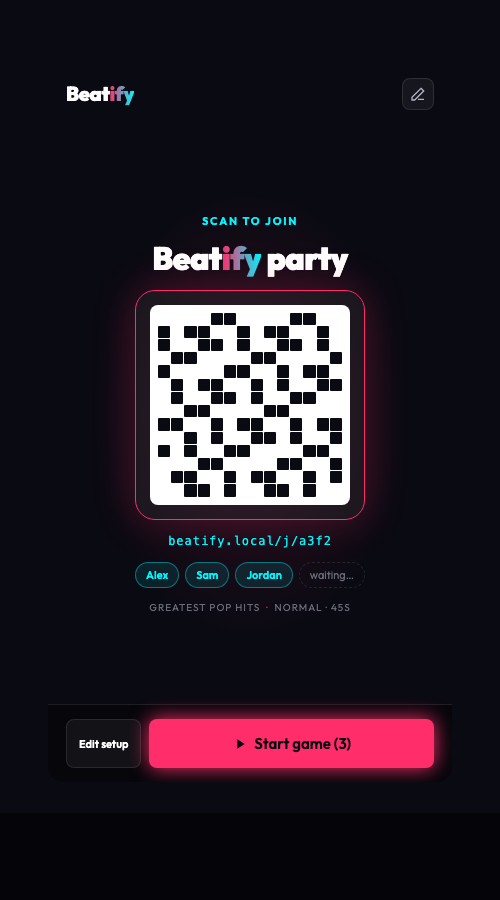
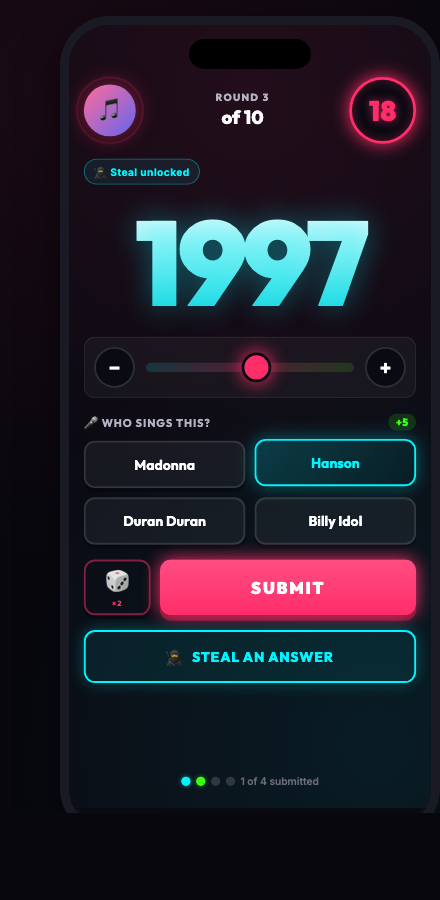
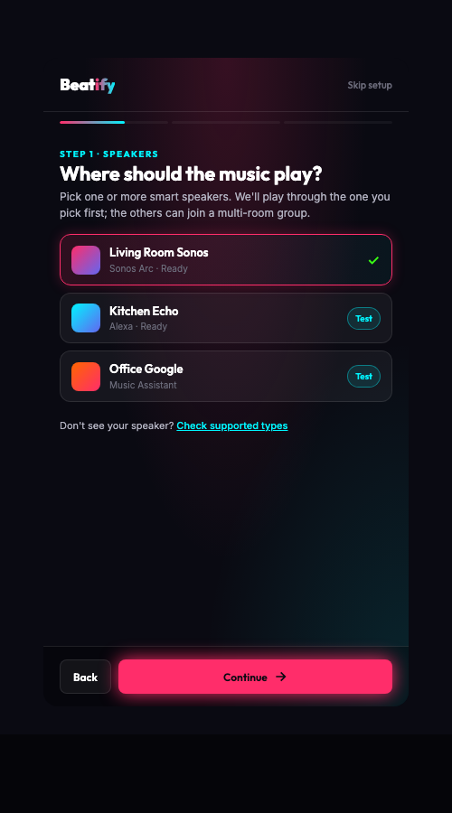
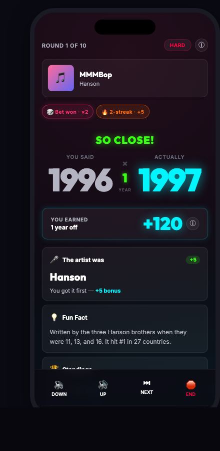
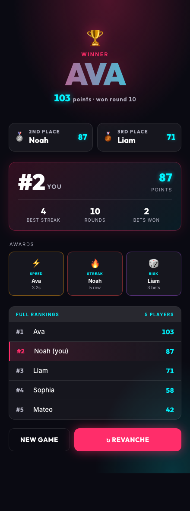

<div align="center">

# Beatify


### **Multiplayer Music Trivia Quiz Game for Home Assistant**

Turn any gathering into an unforgettable music trivia experience.
Guests scan, songs play, everyone competes. It's that simple.

[](https://www.home-assistant.io/)
[](https://github.com/mholzi/beatify/releases)
[](LICENSE)

[**Get Started**](#setup-in-home-assistant) • [**Supported Speakers**](#supported-speakers) • [**See It In Action**](#the-experience)

---

</div>

<br>

## What Is Beatify?

**Beatify is an open-source music quiz game for Home Assistant** — a multiplayer music trivia party game that turns your smart speakers into a game show.

A song plays through your Sonos, Alexa, or Music Assistant speakers. Everyone races to guess the release year. Points fly. Streaks build. Champions emerge.

No apps to download. No accounts to create. Just scan a QR code and play.

---

<br>

## Why Parties Are Better With Beatify

**Zero Friction Entry** — Guests scan a QR code. That's it. No apps. No accounts. No WiFi password drama. 10 seconds from scan to playing.

**Uses Your Existing Smart Speakers** — Works with Music Assistant, Sonos, and Alexa speakers you already have. See [Supported Speakers](#supported-speakers) for details.

**Your Music, Your Vibe** — Spotify, Apple Music, YouTube Music, Tidal, or Deezer playlists. Curated song packs included. Create your own.

**Runs Locally** — No cloud. No subscription. No data leaves your network. Fast, private, reliable.

**Everyone Competes** — Points, streaks, power-ups, and a dramatic finale with podium and stats. Real competition, real laughs.

---

<br>

## Setup In Home Assistant

### Step 1: Install

**Via HACS (Recommended)** — One click to add the repository, then install:

[](https://my.home-assistant.io/redirect/hacs_repository/?owner=mholzi&repository=beatify&category=integration)

Or manually:
```
HACS → ⋮ Menu → Custom Repositories
→ URL: https://github.com/mholzi/beatify
→ Category: Integration
→ Install "Beatify"
→ Restart Home Assistant
```

**Manual**
```bash
cd /config/custom_components
git clone https://github.com/mholzi/beatify.git beatify
# Restart Home Assistant
```

### Step 2: Configure

[](https://my.home-assistant.io/redirect/config_flow_start/?domain=beatify)

Or manually:
```
Settings → Devices & Services → Add Integration → "Beatify"
```

That's it. Beatify is now installed.

---

<br>

## Opening Beatify (Admin)

After installation, access Beatify to start a game:

### Option 1: HA Sidebar (Recommended)

Beatify automatically adds itself to your Home Assistant sidebar.

1. Open Home Assistant
2. Look for **Beatify** in the left sidebar
3. Click to open the launcher
4. Hit **"Open Beatify"** — the game opens in a fullscreen new tab (no HA chrome)

> **Tip:** If you don't see Beatify in the sidebar, restart Home Assistant.

### Option 2: Direct URL

```
http://YOUR-HA-IP:8123/beatify/admin
```

### Option 3: HA Companion App

1. Open the HA Companion app
2. Tap the menu (☰) or swipe from left
3. Select **Beatify** from the sidebar

### Starting a Game

1. **Select a speaker** — Only [supported speakers](#supported-speakers) appear
2. **Choose your music service** — Spotify, Apple Music, YouTube Music, Tidal, or Deezer (depends on speaker)
3. **Pick playlists** — Select one or more
4. **Adjust settings** — Language, timer, difficulty
5. **Start Game** — Share the QR code with guests

<div align="center">

<!-- SCREENSHOT: QR code display with join URL -->


*Print it. Display it. Share it.*

</div>

---

<br>

## The Experience

<div align="center">

### For Players

<!-- SCREENSHOT: Player's phone showing the year slider and album art -->


*Slide to guess. Tap to submit. Pray you're right.*

</div>

**The Rush**
A song starts playing. The clock is ticking. You *know* this song... but was it '85 or '87?

**The Strategy**
Answer fast for bonus points. Hit a streak for multipliers. Feeling confident? Bet double-or-nothing.

**The Reveal**
The year drops. The room erupts. Someone nailed it. Someone was *way* off. Everyone's laughing.

Gold confetti bursts for exact guesses. Chart positions and fun facts appear. You just learned that song spent 22 weeks at #1.

<br>

<div align="center">

### For Hosts

<!-- SCREENSHOT: Admin setup screen with media player and playlist selection -->


*Select speakers. Pick playlists. Start the party.*

</div>

**Full Control**
Skip tracks. Adjust volume. Pause the game. End early if needed. All from your phone.

**Customize the Challenge**
Set round timers (15s/30s/45s) and difficulty levels (Easy/Normal/Hard) to match your group.

**Print the QR**
Physical QR code printout for the coffee table. Guests join themselves.

**Play Along**
Join as a player with admin controls. Compete and manage simultaneously.

---

<br>

## Game Features

<div align="center">

<!-- SCREENSHOT: Reveal screen showing correct year, fun fact, and scores -->


*The moment of truth. Every single round.*

</div>

### Scoring That Creates Drama

Choose your difficulty—each changes how points are awarded:

| Difficulty | Exact | Close | Near | The Vibe |
|------------|-------|-------|------|----------|
| 😊 **Easy** | 10 pts | ±7 yrs = 5 pts | ±10 yrs = 1 pt | Forgiving |
| 🎯 **Normal** | 10 pts | ±3 yrs = 5 pts | ±5 yrs = 1 pt | Balanced |
| 🔥 **Hard** | 10 pts | ±2 yrs = 3 pts | — | Punishing |

### Speed Bonus
Submit instantly: **2x multiplier**
Submit at deadline: **1x multiplier**
Linear scale in between. Hesitation costs points.

### Streak Milestones
- **3 in a row:** +20 bonus points
- **5 in a row:** +50 bonus points
- **10 in a row:** +100 bonus points
- **15 in a row:** +150 bonus points
- **20 in a row:** +250 bonus points
- **25 in a row:** +400 bonus points

Miss one? Streak resets. The pressure is real.

### Double or Nothing
Feeling confident? Toggle the bet before submitting.
Score points: **Double them.**
Score zero: **Lose it all.**

### Artist Challenge (Optional)
Know your artists? Enable this mode in game setup.
Guess the artist after the song: **+5 bonus points.**
Alternate names accepted—"Prince" or "The Artist" both count.

---

<br>

## The Finale

<div align="center">

<!-- SCREENSHOT: End game podium showing top 3 players with medals -->


*Glory. Bragging rights. Maybe a rematch.*

</div>

Fireworks explode for the winner. Full podium with medals. Personal stats. Best streaks. Bets won.

See how your game compared to all-time averages. Set a new record? Rainbow confetti and a "NEW RECORD!" badge.

Everything you need to demand a rematch.

---

<br>

## Viewing & Selecting Playlists

Playlists are displayed on the main Beatify admin screen:

1. Open Beatify (see above)
2. Scroll to the **Playlists** section
3. Check the boxes next to playlists you want to use in your game
4. Selected playlists show their song count

### Included Playlists

Beatify comes with 2,482 songs across 24 curated playlists:

- 🎸 **60s Classics** — 45 tracks from the golden age of rock & roll
- 🎹 **80s Hits** — 208 classic hits from the decade of synths and MTV
- 🎵 **90s Hits** — 32 essential tracks from the decade
- 🎵 **2000s Pop Anthems** — 150 essential pop hits from the 2000s
- 🎤 **90s & 2000s Hip-Hop Bangers** — 40 tracks from 2Pac, Eminem, JAY-Z, Nas, Dr. Dre and more
- 🇪🇸 **100% en Español** — 127 Latin & Spanish classics
- 🎬 **100 Greatest Movie Themes** — 162 iconic film soundtracks
- ☀️ **100 Summer Anthems** — 112 feel-good tracks from 1957-2020
- 🇬🇧 **British Invasion & Britpop** — 100 tracks from The Beatles to Blur
- 🎭 **Cologne Carnival** — 290 German carnival favorites
- 🕺 **Disco & Funk Classics** — 76 essential disco and funk tracks from the 70s and 80s
- 💥 **Eurodance 90s** — 100 party songs from the eurodance era
- 🏆 **Eurovision Winners (1956-2025)** — 72 winning songs
- 🧃 **Gen Z Anthems** — 30 tracks from TikTok to Good Luck, Babe! spanning 2009–2024
- 💃 **Fiesta Latina 90s** — 50 Latin party anthems from Shakira, Ricky Martin, Maná
- 🤘 **Greatest Metal Songs** — 52 legendary tracks across all major metal subgenres
- 🎯 **Greatest Hits of All Time** — 180 chart-toppers across four decades
- 🎵 **Motown & Soul Classics** — 100 iconic soul tracks from Diana Ross, Marvin Gaye, The Temptations
- 🎤 **One-Hit Wonders** — 98 flash-in-the-pan classics
- 💔 **Power Ballads** — 99 epic rock ballads from the 80s and 90s
- 🎸 **Pure Pop Punk** — 100 essential pop-punk tracks from the 2000s
- 🇩🇪 **Schlager Classics** — 60 German schlager classics
- 🇳🇱 **Top 100 Dutch Classics** — 100 Nederlandstalig tracks
- ⛵ **Yacht Rock** — 100 smooth West Coast classics from the 70s and 80s

### Adding Custom Playlists

Custom playlists are stored in: `config/beatify/playlists/`

See [Creating Playlists](#creating-playlists) for the JSON format.

---

<br>

## Creating Playlists

Beatify uses simple JSON playlists stored in `config/beatify/playlists/`.

```json
{
  "name": "80s Classics",
  "songs": [
    {
      "year": 1983,
      "uri": "spotify:track:4cOdK2wGLETKBW3PvgPWqT",
      "fun_fact": "Spent 8 weeks at #1"
    },
    {
      "year": 1985,
      "uri": "spotify:track:2374M0fQpWi3dLnB54qaLX",
      "fun_fact": "Written in just 10 minutes"
    }
  ]
}
```

**Playlist Tips:**
- Mix decades for variety
- Include recognizable songs (obscure = frustrating)
- Add fun facts for the reveal screen
- 10-20 songs per playlist works great

Sample playlists are included to get you started immediately.

---

<br>

## Multi-Language Support

Beatify speaks your guests' language.

- **English** — Full support
- **Deutsch** — Vollständige Unterstützung
- **Español** — Soporte completo
- **Français** — Support complet
- **Nederlands** — Volledige ondersteuning

Select during game setup. All players see the chosen language. Fun facts and awards are also translated!

---

<br>

## Supported Speakers

Beatify works with specific Home Assistant integrations that support music playback:

| Integration | Supported | Spotify | Apple Music | YouTube Music | Tidal | Deezer | How It Works |
|-------------|-----------|---------|-------------|---------------|-------|--------|--------------|
| **[Music Assistant](https://music-assistant.io/)** | ✅ Yes | ✅ | ✅ | ✅ | ✅ | ✅ | Direct URI playback to any connected speaker |
| **Sonos** | ✅ Yes | ✅ | ❌ | ❌ | ❌ | ❌ | Direct Spotify playback via Sonos integration |
| **Alexa Media Player** | ✅ Yes | ✅ | ✅ | ❌ | ❌ | ❌ | Voice search playback ("Play [song] on Spotify") |
| **Cast (Chromecast/Nest/Google TV)** | ❌ No | — | — | — | — | — | Use Music Assistant instead |
| **HomePod** | ❌ No | — | — | — | — | — | Use Music Assistant instead |

### Why Some Speakers Don't Work Directly

**Cast devices** (Chromecast, Nest Audio, Nest Hub, Google TV) and **HomePod** don't support direct music playback from Home Assistant. They require a streaming source.

**The solution:** Install [Music Assistant](https://music-assistant.io/) and add your Cast/HomePod devices there. Music Assistant acts as the streaming source and works perfectly with Beatify.

### Quick Compatibility Check

In Beatify's admin screen:
- ✅ **Supported players** show with a platform badge (Music Assistant, Sonos, Alexa)
- ❌ **Unsupported players** (Cast, etc.) are hidden with a hint to use Music Assistant

### Guest WiFi / Network Setup

Beatify runs entirely within Home Assistant's HTTP server — **no extra ports or services needed**.

| Protocol | Port | Purpose |
|----------|------|---------|
| HTTP/HTTPS | 8123 (default) | Game UI, API, static assets |
| WebSocket | 8123 (same port) | Real-time game communication |

**If guests are on a separate WiFi/VLAN**, add a single firewall rule:

```
Guest VLAN → HA IP : TCP 8123
```

That's it. No mDNS, no broadcast, no additional ports.

**Tips:**
- The QR code uses the HA URL as seen by the admin's browser — make sure that URL is reachable from the guest network
- If using a reverse proxy (nginx/Caddy), ensure WebSocket upgrades are allowed for `/beatify/ws` (standard HA proxy configs already handle this)
- If using HTTPS with a self-signed cert, guests may need to accept it once

> **⚠️ Fritzbox users:** The Fritzbox guest WiFi fully isolates clients from your home network — this cannot be overridden with firewall rules. Players must join the main WiFi, or use a separate VLAN-capable router/access point to create a guest network with selective LAN access.

---

<br>

## Technical Details

### Requirements
- **Home Assistant** 2024.1+
- **Supported media player** (see [Supported Speakers](#supported-speakers) above)
- **HACS** (recommended) or manual installation

### How It Works
- Native Home Assistant integration
- WebSocket-based real-time sync
- Local processing—no cloud required
- Session persistence for reconnection
- Up to 20+ concurrent players

### Architecture
```
Home Assistant
    └── Beatify Integration
            ├── Game State Manager
            ├── WebSocket Handler
            ├── Media Player Service
            └── Web UI (Admin + Player)
```

See [ARCHITECTURE.md](docs/ARCHITECTURE.md) for the full system overview and [WEBSOCKET.md](docs/WEBSOCKET.md) for the WebSocket API protocol.

---

<br>

## FAQ

<details>
<summary><strong>How many players can join?</strong></summary>
<br>
Tested with 20+ players. Your WiFi is the only real constraint.
</details>

<details>
<summary><strong>Can someone join mid-game?</strong></summary>
<br>
Yes! Late joiners inherit the average score so they can compete fairly.
</details>

<details>
<summary><strong>What if the host disconnects?</strong></summary>
<br>
Game pauses automatically. Reconnect and continue exactly where you left off.
</details>

<details>
<summary><strong>What music services work?</strong></summary>
<br>
Spotify, Apple Music, YouTube Music, Tidal, and Deezer. Support depends on your speaker platform—see the <a href="#supported-speakers">Supported Speakers</a> table for details.
</details>

<details>
<summary><strong>Why don't my Chromecast/Nest speakers appear?</strong></summary>
<br>
Cast devices (Chromecast, Nest Audio, Nest Hub, Google TV) don't support direct music playback from Home Assistant. Install <a href="https://music-assistant.io/">Music Assistant</a> and add your Cast devices there—they'll then appear in Beatify and work perfectly.
</details>

<details>
<summary><strong>Do players need to be on the same network?</strong></summary>
<br>
Yes, players need to access your Home Assistant instance. Works great on home WiFi.
</details>

<details>
<summary><strong>Can I customize the theme?</strong></summary>
<br>
The neon dark theme is built-in and looks stunning. Custom theming is on the roadmap.
</details>

---

<br>

## What's New

### v3.1.0 — Admin Makeover & Stability 🎛️
- **Admin Dashboard Overhaul** — Rebuilt spectator view mirrors the player layout: large album cover, countdown timer, player-dot tracker with bet/steal badges, leaderboard with streaks and rank changes, and podium end screen
- **Admin Joins as Player — Full Experience** — Host redirect to the player page with all 18 game features plus a fixed admin control bar. No more degraded mini-UI
- **Wake Lock** — Screen stays awake during gameplay on mobile devices
- **WebSocket Reconnect on Tab Return** — Auto-reconnects when switching apps or returning from lock screen, with clear error messaging on connection loss
- **Intro Round for Non-Playing Admin** — Admins who don't join as player can now confirm intro rounds
- 16 bug fixes, 6 security hardening fixes, 12 performance fixes, 15 broken streaming URIs replaced
- 24 playlists, 2,482 songs, 5 music platforms, 5 languages

### v3.0.0 — Dynamic Lights, Balanced Playlists & Security Hardening 💡
- **Dynamic Light Effects & WLED Support** — Lights pulse during playback and react to game events (gold flash for exact matches, green for off-by-one, orange for streaks). Three modes: Static, Dynamic (new default), and WLED with configurable presets
- **Balanced Playlist Selection** — Multiple playlists now get equal weight instead of larger playlists dominating. Cross-playlist duplicates auto-deduplicated
- **+10s Seek Forward** — New admin button to skip past silent intros
- **Admin Spectator Mode** — Watch and control the game without being a player
- **Closest Wins Mode** — Only the player with the closest guess scores each round
- **HA Sensor Entities** — Live game state exposed as Home Assistant entities for automations and dashboards
- **TTS Announcements** — Voice feedback for game start and winner reveal via any HA TTS entity
- **Gen Z Anthems playlist** — 30 songs from TikTok to Good Luck, Babe! (2009–2024)
- Security hardening, 20+ bug fixes, 268 broken streaming URIs replaced
- 24 playlists, 2,482 songs, 5 music platforms, 5 languages

### v2.9.1 — Party Lights, Dutch & Stability 🎉
- **Party Lights** — Automated light control during games with intensity presets (Subtle/Medium/Party), admin light picker, and preview button. Subtle mode scales relative to your pre-game brightness: +0% lobby, +20% playing, +40% reveal and end
- **Dutch language support** — Fifth language joins EN, DE, FR, ES. Full UI translations and Dutch fun facts and awards across all playlists
- **12 bugs fixed** — 5 high-severity and 7 medium-severity findings from systematic code review, including admin claim guard, null song scoring, intro timer restart, MA playback timeout, and Dutch game state serialization
- **38% smaller assets** — All CSS/JS minified and bundled via esbuild, 590KB → 364KB
- **5 architecture refactors** — ChallengeManager, PowerUpManager, PlayerRegistry, shared state serializer, WebSocket public API
- 39 dead streaming URIs replaced across greatest-hits-of-all-time and motown-soul-classics
- 23 playlists, 2,453 songs, 5 music platforms, 5 languages

### v2.8.0 — Deezer, Smarter Intro Mode & Architecture Overhaul 🎵
- **Deezer Support** — Fifth streaming service joins Spotify, YouTube Music, Apple Music and Tidal. 2,000+ Deezer URIs across 19 playlists
- **Smarter Intro Mode** — Intro rounds delayed until round 4, admin-confirmed splash screen explains rules before music plays, duration increased to 15 seconds
- **Music Assistant + YouTube Music Fix** — Non-blocking playback with state polling for reliable MA+YTMusic support. By @Scribblerman
- **90s & 2000s Hip Hop Bangers** — 40 tracks (1990–2008) from 2Pac, Eminem, JAY-Z, Nas, Missy Elliott, Dr. Dre and more
- Refactored player.js into ES modules, split scoring god functions, added unit tests, rate limiting, XSS protection, 276 broken URIs fixed
- 23 playlists, 2,453 songs, 5 music platforms, 4 languages

### v2.7.0 — UX Polish & Playlist Expansion 🎵
- **PWA: Add to Homescreen** — Beatify installs as a Progressive Web App via an install prompt on the admin screen or the explicit install button in the header
- **Share Your Results** — End screen includes a Wordle-style emoji grid of your round results. Native share sheet on mobile, card download on desktop
- **Revanche (Rematch)** — Players can challenge for a rematch directly from the end screen — no QR re-scan needed
- **Greatest Metal Songs playlist** — 52 legendary tracks across all major metal subgenres (1970–2020), fully enriched with certifications, awards and streaming links
- **Dutch Top 100 enriched** — *Top 100 Allertijden Nederlandstalig* now has fun facts in 4 languages and alternative artist suggestions for every track
- 22 playlists, 2,415 songs, 4 music platforms, 4 languages

### v2.6.0 — Game Highlights Reel 🎬
- **Game Highlights Reel** — After every game, Beatify auto-generates a highlight reel of the Top 8 moments: exact year matches, best streaks, speed records, comebacks, bet wins, heartbreakers, and photo finishes
- 21 playlists, 2,363 songs, 4 music platforms, 4 languages

### v2.5.0 — Intro Mode, Quick Rematch & Fullscreen Launcher
- **Intro Mode** — Random rounds play only 10 seconds of the song, then silence. Fullscreen ⚡ splash overlay, guaranteed every 4 rounds
- **Quick Rematch** — Hit Rematch on the scoreboard to restart with the same settings and players
- **Fullscreen Launcher** — Sidebar opens a launcher that pops the game into a clean new tab (no HA chrome)
- **Comeback King superlative** — Awarded to the player who improves the most during a game
- **Film Buff superlative** — Awarded for the most movie quiz bonus points
- **Faster round transitions** — Preflight caching + timeout-bounded playback cuts dead time between rounds
- **Apple Music & Tidal fix** — URIs correctly converted for Music Assistant playback
- **HA 2026.2 compatible** — Eliminated blocking I/O warnings
- **3 new/expanded playlists** — 100% en Español (127 songs), 80s Hits expanded (208 songs), Top 100 Dutch Classics (100 songs)
- **All playlist names standardized to English** — Consistent naming across all 21 playlists
- 21 playlists, 2,363 songs, 4 music platforms, 4 languages

### v2.4.0 — Tidal & Movie Quiz
- **Tidal support** — Fourth streaming provider (Spotify, Apple Music, YouTube Music, Tidal)
- **Movie Quiz Bonus** — Guess the movie a soundtrack is from for tiered bonus points (5/3/1)
- **French language** — Fourth UI language (EN, DE, ES, FR)
- **Film Buff superlative** — New end-game award for movie quiz performance
- **2 new playlists** — British Invasion & Britpop (100 songs), Summer Party Anthems (112 songs)
- All playlists enriched with Tidal URIs

### v2.3.2 — Soul, Disco & Latin Expansion 🎵
- **3 new playlists** — Motown & Soul Classics (100 songs), Disco & Funk Classics (76 songs), Fiesta Latina 90s (50 songs)
- **Data quality pass** — Added artist/title to Movies & Schlager (222 tracks), normalized Karneval chart data
- **Streaming URI enrichment** — 82 new Apple Music and YouTube Music URIs across Movies and Power Ballads
- **Enrichment tooling** — New `enrich_playlists.py` script for automated cross-platform URI lookup

### v2.3.0 — Playlist Tags & Filter UI 🏷️
- **Tag-based filtering** — Filter playlists by decade, genre, region, and mood in the Admin UI
- **Pure Pop Punk playlist** — 100 essential pop-punk tracks from the 2000s
- **Yacht Rock playlist** — 100 smooth West Coast classics
- **Expanded 80er Hits** — Grew from 100 to 125 tracks
- **New 90er Hits** — 32 essential tracks from the decade

### v2.2.0 — YouTube Music & Playlist Requests 🎵
- **YouTube Music support** — Use YouTube Music as your music provider alongside Spotify and Apple Music
- **Custom playlist requests** — Users can request Spotify playlists directly from the Beatify interface
- **80er Hits playlist** — 100 classic hits from Michael Jackson, Prince, Madonna, A-ha, and more

### v2.1.0 — Smart Speaker Routing 🔊
- **Multi-platform speaker support** — Automatic detection for Music Assistant, Sonos, and Alexa
- **Dynamic music service selector** — Shows only compatible services for your selected speaker
- **Cast device guidance** — Helpful hints for Chromecast/Nest users to install Music Assistant

### v2.0.0 — React & Reveal 🎭✨
- **Live emoji reactions** — Send 🔥 😂 😮 👏 💀 reactions during reveals that float across all screens
- **Artist Challenge mode** — Guess the artist for +5 bonus points, with alternate name support
- **Early reveal** — Round ends instantly when all players have guessed
- **Complete UI redesign** — Collapsible admin sections, unified lobbies, compact reveal view
- **One-Hit Wonders playlist** — 98 songs celebrating flash-in-the-pan hits
- **Kölner Karneval playlist** — 291 songs of Cologne carnival tradition

### v1.5.0 — Data & Speed 📊⚡
- **Admin analytics dashboard** — Track games played, popular playlists, player stats, and error rates
- **Mobile performance boost** — 53% smaller bundles, lazy loading, adaptive animations
- **Music Assistant support** — Native playback service for reliable MA integration
- **Styled confirmation dialogs** — No more ugly browser popups
- **Game settings display** — See rounds and difficulty in the player lobby

### v1.4.0 — Fiesta Internacional 🌍
- **Spanish language support** — Full UI and playlist content in Spanish
- **German playlist content** — Fun facts and awards translated for all 370 songs
- **TV Dashboard improvements** — Easier to find, shows round stats and fun facts
- **Invite late joiners** — QR popup during gameplay for latecomers
- **Admin lobby makeover** — Dark theme, player list, real-time updates
- **Alexa fix** — Spotify playback now works on Alexa devices

### v1.3.0 — Steal the Show 🥷
- **Steal power-up** — Build a 3-streak, then copy another player's answer
- **End-game superlatives** — Awards for Speed Demon, Hot Streak, Risk Taker, Clutch Player, and Close Calls
- **Song difficulty rating** — 1-4 star ratings based on historical player accuracy
- **Reliability improvements** — Pre-flight speaker checks, smart retry logic, graceful error handling

### v1.2.0 — The Party Just Got Better 🎉
- **Rich song information** — Chart history, certifications, awards, and fun facts on every reveal
- **Game statistics** — Track performance across games with all-time averages and "NEW RECORD!" moments
- **Confetti celebrations** — Gold bursts for exact guesses, fireworks for winners, epic shows for perfect games
- **Mystery mode** — Album covers blur during guessing (no more peeking!)
- **New playlist** — Eurovision Winners (1956-2025) with 72 winning songs

### v1.1.0
- **Difficulty presets** — Easy, Normal, or Hard scoring modes
- **Customizable round timer** — Quick (15s), Normal (30s), or Relaxed (45s)
- **Round analytics** — See guess distribution, accuracy stats, and speed champions

[View full changelog →](https://github.com/mholzi/beatify/releases)

---

<br>

## Troubleshooting

**No speakers appearing in Beatify?**
- Only Music Assistant, Sonos, and Alexa Media Player speakers are supported
- Cast devices (Chromecast, Nest, Google TV) require [Music Assistant](https://music-assistant.io/)
- HomePod requires Music Assistant
- See [Supported Speakers](#supported-speakers) for the full compatibility table

**Players can't connect?**
- Verify Home Assistant is accessible on your network
- Try IP address instead of hostname
- Ensure port 8123 is reachable
- Guests on a separate WiFi/VLAN? See [Guest WiFi / Network Setup](#guest-wifi--network-setup) — just open TCP 8123

**Music won't play?**
- Check media player is online in Home Assistant
- Verify playlist URIs are valid for your music service
- For Sonos: Only Spotify is supported (not Apple Music)
- For Alexa: Ensure your music service is linked in the Alexa app
- Check Home Assistant logs for errors

**QR code won't scan?**
- Improve lighting on the display
- Try the "Print QR" feature for a physical copy
- Use a dedicated QR scanner app

---

<br>

## Help & FAQ

Have a question? Check our [Discussions Q&A](https://github.com/mholzi/beatify/discussions/categories/q-a) for answers to common questions about installation, music services, gameplay, and troubleshooting.

💡 **Got an idea?** Share it in [Ideas](https://github.com/mholzi/beatify/discussions/categories/ideas)
🐛 **Found a bug?** Open an [Issue](https://github.com/mholzi/beatify/issues)
🎵 **Want a playlist?** Submit a request through the Admin UI

---

<br>

## Contributing

Contributions welcome! Whether it's a new playlist, a bug fix, or a translation — check our [**CONTRIBUTING.md**](CONTRIBUTING.md) for the full guide.

Developer docs: [Architecture](docs/ARCHITECTURE.md) | [WebSocket API](docs/WEBSOCKET.md) | [Changelog](CHANGELOG.md)

Quick start: Fork → Branch → PR. See [good first issues](https://github.com/mholzi/beatify/issues?q=is%3Aissue+is%3Aopen+label%3A%22good+first+issue%22) for easy starting points.

---

<br>

## License

MIT License. See [LICENSE](LICENSE) for details.

---

<br>

<div align="center">

## Ready to Host?

The next great party moment is one QR scan away.

[**Install Beatify Now**](#setup-in-home-assistant)

---

**The open-source music quiz for Home Assistant. Built for fun.**

[Report Bug](https://github.com/mholzi/beatify/issues) · [Request Feature](https://github.com/mholzi/beatify/issues) · [Discussions](https://github.com/mholzi/beatify/discussions)

<br>

<sub>Made with ❤️ for the Home Assistant community</sub>

</div>
